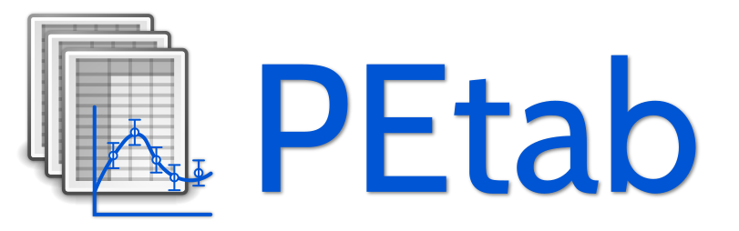
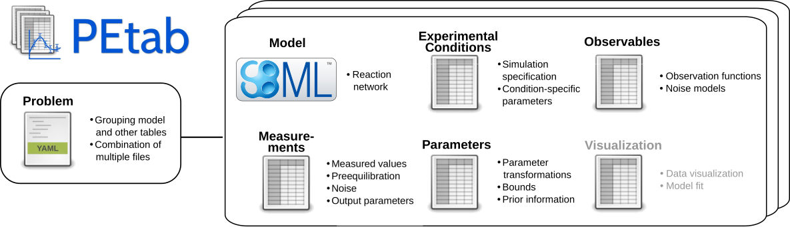

# PEtab -- a data format for specifying parameter estimation problems in systems biology

*PEtab* is a data format for specifying parameter estimation problems in
systems biology. This repository contains the PEtab specifications and
additional documentation.

## About PEtab

PEtab is built around [SBML](http://sbml.org/) and based on tab-separated values 
(TSV) files. It is meant as a standardized way to provide information for 
parameter estimation, which is out of the current scope of SBML. This includes
for example:

  - Specifying and linking measurements to models

    - Defining model outputs

    - Specifying noise models

  - Specifying parameter bounds for optimization

  - Specifying multiple simulation condition with potentially shared parameters

## Documentation

Documentation of the PEtab data format is available at
[https://petab.readthedocs.io/en/latest/](https://petab.readthedocs.io/en/latest/).

## Examples

A wide range of PEtab examples can be found in the systems biology parameter estimation
[benchmark problem collection](https://github.com/Benchmarking-Initiative/Benchmark-Models-PEtab).

## PEtab support in systems biology tools

Where PEtab is supported (in alphabetical order):

  - [AMICI](https://github.com/ICB-DCM/AMICI/)
    ([Example](https://github.com/ICB-DCM/AMICI/blob/master/python/examples/example_petab/petab.ipynb))

  - A PEtab -> [COPASI](http://copasi.org/)
    [converter](https://github.com/copasi/python-petab-importer)

  - [d2d](https://github.com/Data2Dynamics/d2d/)
    ([HOWTO](https://github.com/Data2Dynamics/d2d/wiki/Support-for-PEtab))

  - [dMod](https://github.com/dkaschek/dMod/)
    ([HOWTO](https://github.com/dkaschek/dMod/wiki/Support-for-PEtab))

  - [MEIGO](https://github.com/gingproc-IIM-CSIC/MEIGO64)
    ([HOWTO](https://github.com/gingproc-IIM-CSIC/MEIGO64/tree/master/MEIGO/PEtabMEIGO))

  - [parPE](https://github.com/ICB-DCM/parPE/)

  - [pyABC](https://github.com/ICB-DCM/pyABC/) ([Example](https://pyabc.readthedocs.io/en/latest/examples/petab.html))

  - [pyPESTO](https://github.com/ICB-DCM/pyPESTO/)
    ([Example](https://pypesto.readthedocs.io/en/latest/example/petab_import.html))

  - [SBML2Julia](https://github.com/paulflang/SBML2Julia)
    ([Tutorial](https://sbml2julia.readthedocs.io/en/latest/python_api.html))

If your project or tool is using PEtab, and you would like to have it listed
here, please [let us know](https://github.com/PEtab-dev/PEtab/issues).

### PEtab features supported in different tools

The following list provides an overview of supported PEtab features in
different tools, based on passed test cases of the
[PEtab test suite](https://github.com/PEtab-dev/petab_test_suite):

| ID | Test                                                           | AMICI `>=0.11.19` | Copasi | D2D | dMod | MEIGO | parPE `develop`  | pyABC `>=0.10.1` | pyPESTO `>=0.0.11` | SBML2Julia |
|----|----------------------------------------------------------------|----------------------|--------|-----|------|-------|-----------------------|-------|------------------------|------------|
| 1  | Basic simulation                                               | +++                  | +--    | +++ | +++  | +++   | --+                   | +++   | +++                    | +++        |
| 2  | Multiple simulation conditions                                 | +++                  | +--    | +++ | +++  | +++   | --+                   | +++   | +++                    | +++        |
| 3  | Numeric observable parameter overrides in measurement table    | +++                  | +--    | +++ | +++  | +++   | --+                   | +++   | +++                    | +++        |
| 4  | Parametric observable parameter overrides in measurement table | +++                  | +--    | +++ | +++  | +++   | --+                   | +++   | +++                    | +++        |
| 5  | Parametric overrides in condition table                        | +++                  | +--    | +++ | +++  | +++   | --+                   | +++   | +++                    | +++        |
| 6  | Time-point specific overrides in the measurement table         | ---                  | ---    | +++ | +++  | +++   | ---                   | ---   | ---                    | +++        |
| 7  | Observable transformations to log10 scale                      | +++                  | +--    | +++ | ++-  | +++   | --+                   | +++   | +++                    | +++        |
| 8  | Replicate measurements                                         | +++                  | +--    | +++ | +++  | +++   | --+                   | +++   | +++                    | +++        |
| 9  | Pre-equilibration                                              | +++                  | +--    | +++ | +++  | +++   | --+                   | +++   | +++                    | +++        |
| 10 | Partial pre-equilibration                                      | +++                  | ---    | +++ | +++  | +++   | --+                   | +++   | +++                    | +++        |
| 11 | Numeric initial concentration in condition table               | +++                  | +--    | +++ | +++  | +++   | --+                   | +++   | +++                    | +++        |
| 12 | Numeric initial compartment sizes in condition table           | ---                  | +--    | +++ | +++  | +++   | ---                   | ---   | ---                    | +++        |
| 13 | Parametric initial concentrations in condition table           | +++                  | +--    | +++ | +++  | +++   | --+                   | +++   | +++                    | +++        |
| 14 | Numeric noise parameter overrides in measurement table         | +++                  | +--    | +++ | +++  | +++   | --+                   | +++   | +++                    | +++        |
| 15 | Parametric noise parameter overrides in measurement table      | +++                  | +--    | +++ | +++  | +++   | --+                   | +++   | +++                    | +++        |
| 16 | Observable transformations to log scale                        | +++                  | +--    | +++ | ++-  | +++   | --+                   | +++   | +++                    | +++        |

Legend:
* First character indicates whether computing simulated data is supported and simulations are correct (+) or not (-).
* Second character indicates whether computing chi2 values of residuals are supported and correct (+) or not (-).
* Third character indicates whether computing likelihoods is supported and correct (+) or not (-).

## Using PEtab

If you would like to use PEtab yourself, please have a look at:

* [a PEtab tutorial](https://petab.readthedocs.io/en/latest/tutorial.html)
  going through the individual steps of setting up a parameter estimation
  problem in PEtab, independently of any specific software
* [the PEtab format reference](https://petab.readthedocs.io/en/stable/documentation_data_format.html)
* the example models provided in the
  [benchmark collection](https://github.com/Benchmarking-Initiative/Benchmark-Models-PEtab).
* the tutorials provided with each of the softwares supporting PEtab

To convert your existing parameter estimation problem to the PEtab format, you 
will have to:

1. Specify your model in SBML.

1. Create a condition table.

1. Create a table of observables.

1. Create a table of measurements.

1. Create a parameter table.

If you are using Python, some handy functions of the
[PEtab library](https://github.com/PEtab-dev/libpetab-python/) can help
you with that. This includes also a PEtab validator called `petablint` which
you can use to check if your files adhere to the PEtab standard. If you have 
further questions regarding PEtab, feel free to post an 
[issue](https://github.com/PEtab-dev/PEtab/issues) at our GitHub repository.

## PEtab Python library

PEtab comes with a Python package for creating, checking, visualizing and
working with PEtab files. This package is available at 
https://github.com/PEtab-dev/libpetab-python/.

## PEtab R library

There is also an R package for PEtab in development, which currently supports:
consistent manipulation of experimental conditions, measurements, and
observables; and visualizing measurements. It also provides an interface to the
PEtab Python library, and an interface to dMod that supports: conversion of
dMod models to SBML; and simulation and visualization of results. The package
is available at https://github.com/dlill/petab/.

## Getting help

If you have any question or problems with PEtab, feel free to post them at
our GitHub [issue tracker](https://github.com/PEtab-dev/PEtab/issues/).

## Contributing to PEtab

Contributions and feedback to PEtab are very welcome, see our
[contribution guide](CONTRIBUTING.md).
