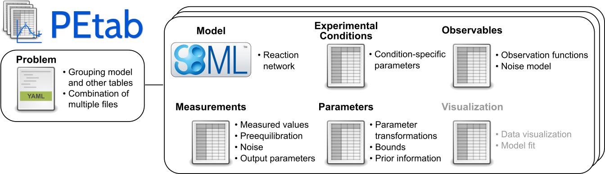

# PEtab -- a data format for specifying parameter estimation problems in systems biology

*PEtab* is a data format for specifying parameter estimation problems in
systems biology. This repository contains the PEtab specifications and
additional documentation.

## About PEtab

PEtab is built around [SBML](http://sbml.org/) and based on tab-separated values
(TSV) files. It is meant as a standardized way to provide information for
parameter estimation, which is out of the current scope of SBML. This includes,
for example:

  - Specifying and linking measurements to models

    - Defining model outputs

    - Specifying noise models

  - Specifying parameter bounds for optimization

  - Specifying multiple simulation conditions with potentially shared parameters

## Documentation

Documentation of the PEtab data format is available at
[https://petab.readthedocs.io/en/latest/](https://petab.readthedocs.io/en/latest/).

## Contributing to PEtab

To participate in PEtab editor elections, discussions on new PEtab
developments, or PEtab-related events, please join our
[petab-discuss mailing list](https://groups.google.com/g/petab-discuss/).

Any contributions and feedback to PEtab are very welcome, see our
[contribution guide](CONTRIBUTING.md).

## Examples

A wide range of PEtab examples can be found in the systems biology parameter estimation
[benchmark problem collection](https://github.com/Benchmarking-Initiative/Benchmark-Models-PEtab).

## PEtab support in systems biology tools

For a list of tools supporting PEtab, see the
[software support page](https://petab.readthedocs.io/en/latest/v1/software_support.html).

## Using PEtab

If you would like to use PEtab yourself, please have a look at:

* [a PEtab tutorial](https://petab.readthedocs.io/en/latest/v1/tutorial/tutorial.html)
  going through the individual steps of setting up a parameter estimation
  problem in PEtab, independently of any specific software
* [the PEtab format reference](https://petab.readthedocs.io/en/latest/v1/documentation_data_format.html)
* the example models provided in the
  [benchmark collection](https://github.com/Benchmarking-Initiative/Benchmark-Models-PEtab).
* the tutorials provided with each of the softwares supporting PEtab

To convert your existing parameter estimation problem to the PEtab format, you
will have to:

1. Specify your model in SBML.

1. Create a condition table.

1. Create a table of observables.

1. Create a table of measurements.

1. Create a parameter table.

1. Create a YAML file that lists the model and all of the tables above.

If you are using Python, some handy functions of the
[PEtab library](https://github.com/PEtab-dev/libpetab-python/) can help
you with that. This includes also a PEtab validator called `petablint` which
you can use to check if your files adhere to the PEtab standard. If you have
further questions regarding PEtab, feel free to post an
[issue](https://github.com/PEtab-dev/PEtab/issues) at our GitHub repository.

## Editing PEtab files

PEtab files can be created or edited using any text editor or spreadsheet
software, or programmatically (see libraries below).
There is also a dedicated graphical user interface for creating and editing
PEtab 1.0 files, called [PEtab-GUI](https://github.com/PEtab-dev/PEtab-GUI/).

## PEtab Python library

PEtab comes with a Python package for creating, checking, visualizing and
working with PEtab files. This package is available at
https://github.com/PEtab-dev/libpetab-python/.

## PEtab R library

There is also an R package for PEtab in development, which currently supports:
consistent manipulation of experimental conditions, measurements, and
observables; and visualizing measurements. It also provides an interface to the
PEtab Python library, and an interface to dMod that supports: conversion of
dMod models to SBML; and simulation and visualization of results. The package
is available at https://github.com/dlill/petab/.

## PEtab extensions

Other standardization-related projects that extend or build on PEtab include:

* [PEtab Select](https://petab-select.readthedocs.io/en/latest/)
  PEtab Select brings model selection to PEtab. It comprises both a
  standardized way to define model selection problems in PEtab and a Python
  library to work with these problems.

* [petabunit](https://github.com/matthiaskoenig/petabunit) (WIP)
  A Python library that extends PEtab to annotate and convert physical units.

* [PEtab SciML](https://github.com/PEtab-dev/petab_sciml) (WIP)
  PEtab SciML brings Scientific Machine Learning (SciML) models that
  combine mechanistic and machine learning models to PEtab. It comprises
  both a standardized way to define SciML problems, and a Python library 
  to work with these problems. 

## Getting help

If you have any questions or problems with PEtab, feel free to post them at
our GitHub [issue tracker](https://github.com/PEtab-dev/PEtab/issues/).
