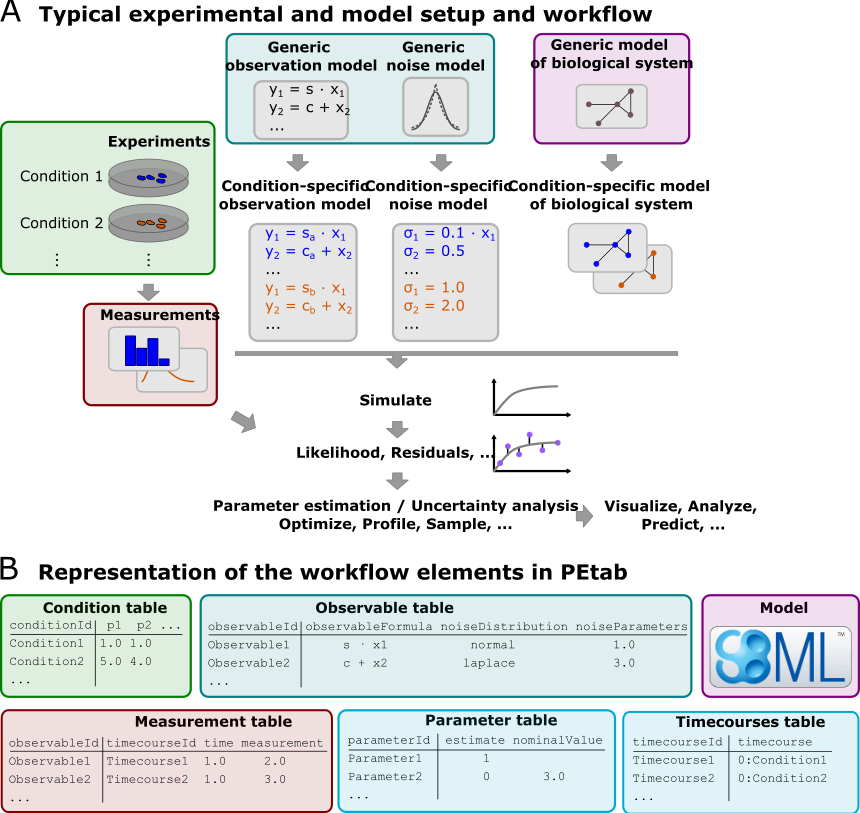

PEtab data format specification
===============================

Format version: 1

This document explains the PEtab data format.

Purpose
-------

Providing a standardized way for specifying parameter estimation problems in
systems biology, especially for the case of Ordinary Differential Equation
(ODE) models.

Scope
-----

The scope of PEtab is the full specification of parameter estimation problems
in typical systems biology applications. In our experience, a typical setup of
data-based modeling starts either with (i) the model of a biological system
that is to be calibrated, or with (ii) experimental data that are to be
integrated and analyzed using a computational model.
Measurements are linked to the biological model by an observation and noise
model. Often, measurements are taken after some perturbations have been
applied, which are modeled as derivations from a generic model
(Figure 1A). Therefore, one goal was to specify such a setup in the
least redundant way. Furthermore, we wanted to establish an intuitive, modular,
machine- and human-readable and -writable format that makes use of existing
standards.

   **Figure 1: A common setup for data-based modeling studies and its representation in PEtab.**

Overview
---------

The PEtab data format specifies a parameter estimation problem using a number
of text-based files (`Systems Biology Markup Language (SBML) <http://sbml.org>`_
and
`Tab-Separated Values (TSV) <https://www.iana.org/assignments/media-types/text/tab-separated-values>`_)
(Figure 2), i.e.

- An SBML model [SBML]

- A measurement file to fit the model to [TSV]

- A condition file specifying model inputs and condition-specific parameters
  [TSV]

- An observable file specifying the observation model [TSV]

- A parameter file specifying estimateable parameters and related information
  [TSV]

- (optional) A simulation file, which has the same format as the measurement
  file, but contains model simulations [TSV]

- (optional) A visualization file, which contains specifications how the data
  and/or simulations should be plotted by the visualization routines [TSV]

.. figure:: gfx/petab_files.png
   :alt: Files constituting a PEtab problem

   **Figure 2: Files constituting a PEtab problem.**

Figure 1B shows how those files relate to a common setup for
data-based modeling studies.

The following sections will describe the minimum requirements of those
components in the core standard, which should provide all information for
defining the parameter estimation problem.

Extensions of this format (e.g. additional columns in the measurement table)
are possible and intended. However, while those columns may provide extra
information for example for plotting, downstream analysis, or for more
efficient parameter estimation, they should not affect the estimation
problem as such.

**General remarks**

- All model entities, column names and row names are case-sensitive
- Fields in "[]" are optional and may be left empty.

SBML model definition
---------------------

The model must be specified as valid SBML. There are no further restrictions.

Condition table
---------------

The condition table specifies parameters, or initial values of species and
compartments for specific simulation conditions (generally corresponding to
different experimental conditions).

This is specified as a tab-separated value file in the following way:

+--------------+------------------+------------------------------------+-----+---------------------------------------+
| conditionId  | [conditionName]  | parameterOrSpeciesOrCompartmentId1 | ... | parameterOrSpeciesOrCompartmentId${n} |
+==============+==================+====================================+=====+=======================================+
| STRING       | [STRING]         | NUMERIC\|STRING                    | ... | NUMERIC\|STRING                       |
+--------------+------------------+------------------------------------+-----+---------------------------------------+
| e.g.         |                  |                                    |     |                                       |
+--------------+------------------+------------------------------------+-----+---------------------------------------+
| conditionId1 | [conditionName1] | 0.42                               | ... | parameterId                           |
+--------------+------------------+------------------------------------+-----+---------------------------------------+
| conditionId2 | ...              | ...                                | ... | ...                                   |
+--------------+------------------+------------------------------------+-----+---------------------------------------+
| ...          | ...              | ...                                | ... | ..                                    |
+--------------+------------------+------------------------------------+-----+---------------------------------------+

Row- and column-ordering are arbitrary, although specifying ``conditionId``
first may improve human readability.

Additional columns are *not* allowed.

Detailed field description
~~~~~~~~~~~~~~~~~~~~~~~~~~

- ``conditionId`` [STRING, NOT NULL]

  Unique identifier for the simulation/experimental condition, to be referenced
  by the measurement table described below. Must consist only of upper and
  lower case letters, digits and underscores, and must not start with a digit.

- ``conditionName`` [STRING, OPTIONAL]

  Condition names are arbitrary strings to describe the given condition.
  They may be used for reporting or visualization.

- ``${parameterOrSpeciesOrCompartmentId1}``

  Further columns may be global parameter IDs, IDs of species or compartments
  as defined in the SBML model. Only one column is allowed per ID.
  Values for these condition parameters may be provided either as numeric
  values, or as IDs defined in the SBML model, the parameter table or both.

  - ``${parameterId}``

    The values will override any parameter values specified in the model.

  - ``${speciesId}``

    If a species ID is provided, it is interpreted as the initial
    condition of that species (as amount if `hasOnlySubstanceUnits` is set to `True` 
    for the respective species, as concentration otherwise) and will override the 
    initial condition given in the SBML model or given by a preequilibration
    condition. If ``NaN`` is provided for a condition, the result of the
    preequilibration (or initial condition from the SBML model, if
    no preequilibration is defined) is used.

  - ``${compartmentId}``

    If a compartment ID is provided, it is interpreted as the initial
    compartment size.

Measurement table
-----------------

A tab-separated values files containing all measurements to be used for
model training or validation.

Expected to have the following named columns in any (but preferably this)
order:

+--------------+-------------------------------+-----------------------+-------------+--------------+
| observableId | [preequilibrationConditionId] | simulationConditionId | measurement | time         |
+==============+===============================+=======================+=============+==============+
| observableId | [conditionId]                 | conditionId           | NUMERIC     | NUMERIC\|inf |
+--------------+-------------------------------+-----------------------+-------------+--------------+
| ...          | ...                           | ...                   | ...         | ...          |
+--------------+-------------------------------+-----------------------+-------------+--------------+

*(wrapped for readability)*

+-----+----------------------------------------------------+----------------------------------------------------+
| ... | [observableParameters]                             | [noiseParameters]                                  |
+=====+====================================================+====================================================+
| ... | [parameterId\|NUMERIC[;parameterId\|NUMERIC][...]] | [parameterId\|NUMERIC[;parameterId\|NUMERIC][...]] |
+-----+----------------------------------------------------+----------------------------------------------------+
| ... | ...                                                | ...                                                |
+-----+----------------------------------------------------+----------------------------------------------------+

Additional (non-standard) columns may be added. If the additional plotting
functionality of PEtab should be used, such columns could be

+-----+-------------+---------------+
| ... | [datasetId] | [replicateId] |
+=====+=============+===============+
| ... | [datasetId] | [replicateId] |
+-----+-------------+---------------+
| ... | ...         | ...           |
+-----+-------------+---------------+

where ``datasetId`` is a necessary column to use particular plotting
functionality, and ``replicateId`` is optional, which can be used to group
replicates and plot error bars.

Detailed field description
~~~~~~~~~~~~~~~~~~~~~~~~~~

- ``observableId`` [STRING, NOT NULL, REFERENCES(observables.observableID)]

  Observable ID as defined in the observable table described below.

- ``preequilibrationConditionId`` [STRING OR NULL, REFERENCES(conditionsTable.conditionID), OPTIONAL]

  The ``conditionId`` to be used for preequilibration. E.g. for drug
  treatments, the model would be preequilibrated with the no-drug condition.
  Empty for no preequilibration.

- ``simulationConditionId`` [STRING, NOT NULL, REFERENCES(conditionsTable.conditionID)]

  ``conditionId`` as provided in the condition table, specifying the condition-specific parameters used for simulation.

- ``measurement`` [NUMERIC, NOT NULL]

  The measured value in the same units/scale as the model output.

- ``time`` [NUMERIC OR STRING, NOT NULL]

  Time point of the measurement in the time unit specified in the SBML model, numeric value or ``inf`` (lower-case) for steady-state measurements.

- ``observableParameters`` [NUMERIC, STRING OR NULL, OPTIONAL]

  This field allows overriding or introducing condition-specific versions of
  output parameters defined in the observation model. The model can define
  observables (see below) containing place-holder parameters which can be
  replaced by condition-specific dynamic or constant parameters. Placeholder
  parameters must be named ``observableParameter${n}_${observableId}``
  with ``n`` ranging from 1 (not 0) to the number of placeholders for the given
  observable, without gaps.
  If the observable specified under ``observableId`` contains no placeholders,
  this field must be empty. If it contains ``n > 0`` placeholders, this field
  must hold ``n`` semicolon-separated numeric values or parameter names. No
  trailing semicolon must be added.

  Different lines for the same ``observableId`` may specify different
  parameters. This may be used to account for condition-specific or
  batch-specific parameters. This will translate into an extended estimation
  parameter vector.

  All placeholders defined in the observation model must be overwritten here.
  If there are no placeholders used, this column may be omitted.

- ``noiseParameters`` [NUMERIC, STRING OR NULL, OPTIONAL]

  The measurement standard deviation or ``NaN`` if the corresponding sigma is a
  model parameter.

  Numeric values or parameter names are allowed. Same rules apply as for
  ``observableParameters`` in the previous point.

- ``datasetId`` [STRING, OPTIONAL]

  The datasetId is used to group certain measurements to datasets. This is
  typically the case for data points which belong to the same observable,
  the same simulation and preequilibration condition, the same noise model,
  the same observable transformation and the same observable parameters.
  This grouping makes it possible to use the plotting routines which are
  provided in the PEtab repository.

- ``replicateId`` [STRING, OPTIONAL]

  The replicateId can be used to discern replicates with the same
  ``datasetId``, which is helpful for plotting e.g. error bars.

Observable table
----------------

Parameter estimation requires linking experimental observations to the model
of interest. Therefore, one needs to define observables (model outputs) and
respective noise models, which represent the measurement process.
Since parameter estimation is beyond the scope of SBML, there exists no
standard way to specify observables (model outputs) and respective noise
models. Therefore, in PEtab observables are specified in a separate table
as described in the following. This allows for a clear separation of the
observation model and the underlying dynamic model, which allows, in  most
cases, to reuse any existing SBML model without modifications.

The observable table has the following columns:

+-----------------------+--------------------------------+-----------------------------------------------------------------------------+
| observableId          | [observableName]               | observableFormula                                                           |
+=======================+================================+=============================================================================+
| STRING                | [STRING]                       | STRING                                                                      |
+-----------------------+--------------------------------+-----------------------------------------------------------------------------+
| e.g.                  |                                |                                                                             |
+-----------------------+--------------------------------+-----------------------------------------------------------------------------+
| relativeTotalProtein1 | Relative abundance of Protein1 | observableParameter1_relativeTotalProtein1 * (protein1 + phospho_protein1 ) |
+-----------------------+--------------------------------+-----------------------------------------------------------------------------+
| ...                   | ...                            | ...                                                                         |
+-----------------------+--------------------------------+-----------------------------------------------------------------------------+

*(wrapped for readability)*

+-----+----------------------------+---------------------------------------+-----------------------+
| ... | [observableTransformation] | noiseFormula                          | [noiseDistribution]   |
+=====+============================+=======================================+=======================+
| ... | [lin(default)\|log\|log10] | STRING\|NUMBER                        | [laplace\|normal]     |
+-----+----------------------------+---------------------------------------+-----------------------+
| ... | e.g.                       |                                       |                       |
+-----+----------------------------+---------------------------------------+-----------------------+
| ... | lin                        | noiseParameter1_relativeTotalProtein1 | normal                |
+-----+----------------------------+---------------------------------------+-----------------------+
| ... | ...                        | ...                                   | ...                   |
+-----+----------------------------+---------------------------------------+-----------------------+

Detailed field description
~~~~~~~~~~~~~~~~~~~~~~~~~~

* ``observableId`` [STRING]

  Unique identifier for the given observable. Must consist only of upper and
  lower case letters, digits and underscores, and must not start with a digit.
  This is referenced by the ``observableId`` column in the measurement table.

* [``observableName``] [STRING, OPTIONAL]

  Name of the observable. Only used for output, not for identification.

* ``observableFormula`` [STRING]

  Observation function as plain text formula expression.
  May contain any symbol defined in the SBML model (including model time ``time``)
  or parameter table. In the simplest case just an SBML species ID
  or an ``AssignmentRule`` target.

  May introduce new parameters of the form ``observableParameter${n}_${observableId}``,
  which are overridden by ``observableParameters`` in the measurement table
  (see description there).

- ``observableTransformation`` [STRING, OPTIONAL]

  Transformation of the observable and measurement for computing the objective
  function. Must be one of ``lin``, ``log`` or ``log10``. Defaults to ``lin``.
  The measurements and model outputs are both assumed to be provided in linear
  space.

* ``noiseFormula`` [NUMERIC|STRING]

  Measurement noise can be specified as a numerical value which will
  default to a Gaussian noise model if not specified differently in
  ``noiseDistribution`` with standard deviation as provided here. In this case,
  the same standard deviation is assumed for all measurements for the given
  observable.

  Alternatively, some formula expression can be provided to specify
  more complex noise models. A noise model which accounts for relative and
  absolute contributions could, e.g., be defined as::

    noiseParameter1_observable_pErk + noiseParameter2_observable_pErk*pErk

  with ``noiseParameter1_observable_pErk`` denoting the absolute and
  ``noiseParameter2_observable_pErk`` the relative contribution for the
  observable ``observable_pErk`` corresponding to species ``pErk``.
  IDs of noise parameters
  that need to have different values for different measurements have the
  structure: ``noiseParameter${indexOfNoiseParameter}_${observableId}``
  to facilitate automatic recognition. The specific values or parameters are
  assigned in the ``noiseParameters`` field of the *measurement table*
  (see above). Any parameters named ``noiseParameter${1..n}_${observableId}``
  *must* be overwritten in the measurement table.

  Noise formulae can also contain observable parameter overrides, which are
  described under ``observableFormula`` in this table. An example is when an
  observable formula contains an override, and a proportional noise model is
  used, which means the observable formula also appears in the noise formula.

- ``noiseDistribution`` [STRING: 'normal' or 'laplace', OPTIONAL]

  Assumed noise distribution for the given measurement. Only normally or
  Laplace distributed noise is currently allowed (log-normal and
  log-Laplace are obtained by setting ``observableTransformation`` to ``log``, similarly for ``log10``).
  Defaults to ``normal``. If ``normal``, the specified ``noiseParameters`` will be
  interpreted as standard deviation (*not* variance). If ``Laplace`` ist specified, the specified ``noiseParameter`` will be interpreted as the scale, or diversity, parameter.

Noise distributions
~~~~~~~~~~~~~~~~~~~

For ``noiseDistribution``, ``normal`` and ``laplace`` are supported. For ``observableTransformation``, ``lin``, ``log`` and ``log10`` are supported. Denote by :math:`y` the simulation, :math:`m` the measurement, and :math:`\sigma` the standard deviation of a normal, or the scale parameter of a laplace model, as given via the ``noiseFormula`` field. Then we have the following effective noise distributions.

- Normal distribution:

  .. math::
     \pi(m|y,\sigma) = \frac{1}{\sqrt{2\pi}\sigma}\exp\left(-\frac{(m-y)^2}{2\sigma^2}\right)

- Log-normal distribution (i.e. log(m) is normally distributed):

  .. math::
     \pi(m|y,\sigma) = \frac{1}{\sqrt{2\pi}\sigma m}\exp\left(-\frac{(\log m - \log y)^2}{2\sigma^2}\right)

- Log10-normal distribution (i.e. log10(m) is normally distributed):

  .. math::
     \pi(m|y,\sigma) = \frac{1}{\sqrt{2\pi}\sigma m \log(10)}\exp\left(-\frac{(\log_{10} m - \log_{10} y)^2}{2\sigma^2}\right)

- Laplace distribution:

  .. math::
     \pi(m|y,\sigma) = \frac{1}{2\sigma}\exp\left(-\frac{|m-y|}{\sigma}\right)

- Log-Laplace distribution (i.e. log(m) is Laplace distributed):

  .. math::
     \pi(m|y,\sigma) = \frac{1}{2\sigma m}\exp\left(-\frac{|\log m - \log y|}{\sigma}\right)

- Log10-Laplace distribution (i.e. log10(m) is Laplace distributed):

  .. math::
     \pi(m|y,\sigma) = \frac{1}{2\sigma m \log(10)}\exp\left(-\frac{|\log_{10} m - \log_{10} y|}{\sigma}\right)

The distributions above are for a single data point. For a collection :math:`D=\{m_i\}_i` of data points and corresponding simulations :math:`Y=\{y_i\}_i` and noise parameters :math:`\Sigma=\{\sigma_i\}_i`, the current specification assumes independence, i.e. the full distributions is

.. math::
   \pi(D|Y,\Sigma) = \prod_i\pi(m_i|y_i,\sigma_i)

Parameter table
---------------

A tab-separated value text file containing information on model parameters.

This table *must* include the following parameters:

- Named parameter overrides introduced in the *conditions table*,
  unless defined in the SBML model
- Named parameter overrides introduced in the *measurement table*

and *must not* include:

- Placeholder parameters (see ``observableParameters`` and ``noiseParameters``
  above)
- Parameters included as column names in the *condition table*
- Parameters that are AssignmentRule targets in the SBML model
- SBML *local* parameters

it *may* include:

- Any SBML model parameter that was not excluded above
- Named parameter overrides introduced in the *conditions table*

One row per parameter with arbitrary order of rows and columns:

+-------------+-----------------+-------------------------+-------------+------------+--------------+----------+-----+
| parameterId | [parameterName] | parameterScale          | lowerBound  | upperBound | nominalValue | estimate | ... |
+=============+=================+=========================+=============+============+==============+==========+=====+
| STRING      | [STRING]        | log10\|lin\|log         | NUMERIC     | NUMERIC    | NUMERIC      | 0\|1     | ... |
+-------------+-----------------+-------------------------+-------------+------------+--------------+----------+-----+
| ...         | ...             | ...                     | ...         | ...        | ...          | ...      | ... |
+-------------+-----------------+-------------------------+-------------+------------+--------------+----------+-----+

*(wrapped for readability)*

+-----+---------------------------+---------------------------------+----------------------+----------------------------+
| ... | [initializationPriorType] | [initializationPriorParameters] | [objectivePriorType] | [objectivePriorParameters] |
+=====+===========================+=================================+======================+============================+
| ... | *see below*               | *see below*                     | *see below*          | *see below*                |
+-----+---------------------------+---------------------------------+----------------------+----------------------------+
| ... | ...                       | ...                             | ...                  | ...                        |
+-----+---------------------------+---------------------------------+----------------------+----------------------------+

Additional columns may be added.

Detailed field description
~~~~~~~~~~~~~~~~~~~~~~~~~~

- ``parameterId`` [STRING, NOT NULL]

  The ``parameterId`` of the parameter described in this row. This has to match
  the ID of a parameter specified in the SBML model, a parameter introduced
  as override in the condition table, or a parameter occurring in the
  ``observableParameters`` or ``noiseParameters`` column of the measurement table
  (see above).

- ``parameterName`` [STRING, OPTIONAL]

  Parameter name to be used e.g. for plotting etc. Can be chosen freely. May
  or may not coincide with the SBML parameter name.

- ``parameterScale`` [lin|log|log10]

  Scale of the parameter to be used during parameter estimation.

- ``lowerBound`` [NUMERIC]

  Lower bound of the parameter used for estimation.
  Optional, if ``estimate==0``.
  Must be provided in linear space, independent of ``parameterScale``.

- ``upperBound`` [NUMERIC]

  Upper bound of the parameter used for estimation.
  Optional, if ``estimate==0``.
  Must be provided in linear space, independent of ``parameterScale``.

- ``nominalValue`` [NUMERIC]

  Some parameter value to be used if
  the parameter is not subject to estimation (see ``estimate`` below).
  Must be provided in linear space, independent of ``parameterScale``.
  Optional, unless ``estimate==0``.

- ``estimate`` [BOOL 0|1]

  1 or 0, depending on, if the parameter is estimated (1) or set to a fixed
  value(0) (see ``nominalValue``).

- ``initializationPriorType`` [STRING, OPTIONAL]

  Prior types used for sampling of initial points for estimation. Sampled
  points are clipped to lie inside the parameter boundaries specified by
  ``lowerBound`` and ``upperBound``. Defaults to ``parameterScaleUniform``.

  Possible prior types are:

    - *uniform*: flat prior on linear parameters
    - *normal*: Gaussian prior on linear parameters
    - *laplace*: Laplace prior on linear parameters
    - *logNormal*: exponentiated Gaussian prior on linear parameters
    - *logLaplace*: exponentiated Laplace prior on linear parameters
    - *parameterScaleUniform* (default): Flat prior on original parameter
      scale (equivalent to "no prior")
    - *parameterScaleNormal*: Gaussian prior on original parameter scale
    - *parameterScaleLaplace*: Laplace prior on original parameter scale

- ``initializationPriorParameters`` [STRING, OPTIONAL]

  Prior parameters used for sampling of initial points for estimation,
  separated by a semicolon. Defaults to ``lowerBound;upperBound``.
  The parameters are expected to be in linear scale except for the
  ``parameterScale`` priors, where the prior parameters are expected to be
  in parameter scale.

  So far, only numeric values will be supported, no parameter names.
  Parameters for the different prior types are:

    - uniform: lower bound; upper bound
    - normal: mean; standard deviation (**not** variance)
    - laplace: location; scale
    - logNormal: parameters of corresp. normal distribution (see: normal)
    - logLaplace: parameters of corresp. Laplace distribution (see: laplace)
    - parameterScaleUniform: lower bound; upper bound
    - parameterScaleNormal: mean; standard deviation (**not** variance)
    - parameterScaleLaplace: location; scale

- ``objectivePriorType`` [STRING, OPTIONAL]

  Prior types used for the objective function during estimation.
  For possible values, see ``initializationPriorType``.

- ``objectivePriorParameters`` [STRING, OPTIONAL]

  Prior parameters used for the objective function during estimation.
  For more detailed documentation, see ``initializationPriorParameters``.

Visualization table
-------------------

A tab-separated value file containing the specification of the visualization
routines which come with the PEtab repository. Plots are in general
collections of different datasets as specified using their ``datasetId`` (if
provided) inside the measurement table.

Expected to have the following columns in any (but preferably this)
order:

+--------+------------+-------------------------------------------+------------------------------------------------------+
| plotId | [plotName] | [plotTypeSimulation]                      | [plotTypeData]                                       |
+========+============+===========================================+======================================================+
| STRING | [STRING]   | [LinePlot(default)\|BarPlot\|ScatterPlot] | [MeanAndSD(default)\|MeanAndSEM\|replicate;provided] |
+--------+------------+-------------------------------------------+------------------------------------------------------+
| ...    | ...        | ...                                       | ...                                                  |
+--------+------------+-------------------------------------------+------------------------------------------------------+

*(wrapped for readability)*

+-----+-------------+-------------------------------------+-----------+----------+--------------------------+
| ... | [datasetId] | [xValues]                           | [xOffset] | [xLabel] | [xScale]                 |
+=====+=============+=====================================+===========+==========+==========================+
| ... | [datasetId] | [time(default)\|parameterOrStateId] | [NUMERIC] | [STRING] | [lin\|log\|log10\|order] |
+-----+-------------+-------------------------------------+-----------+----------+--------------------------+
| ... | ...         | ...                                 | ...       | ...      | ...                      |
+-----+-------------+-------------------------------------+-----------+----------+--------------------------+

*(wrapped for readability)*

+-----+----------------+-----------+----------+-------------------+---------------+
| ... | [yValues]      | [yOffset] | [yLabel] | [yScale]          | [legendEntry] |
+=====+================+===========+==========+===================+===============+
| ... | [observableId] | [NUMERIC] | [STRING] | [lin\|log\|log10] | [STRING]      |
+-----+----------------+-----------+----------+-------------------+---------------+
| ... | ...            | ...       | ...      | ...               | ...           |
+-----+----------------+-----------+----------+-------------------+---------------+

Detailed field description
~~~~~~~~~~~~~~~~~~~~~~~~~~

- ``plotId`` [STRING, NOT NULL]

  An ID which corresponds to a specific plot. All datasets with the same
  plotId will be plotted into the same axes object.

- ``plotName`` [STRING, OPTIONAL]

  A name for the specific plot.

- ``plotTypeSimulation`` [STRING, OPTIONAL]

  The type of the corresponding plot, can be ``LinePlot``, ``BarPlot`` and ``ScatterPlot``. Default is ``LinePlot``.

- ``plotTypeData`` [STRING, OPTIONAL]

  The type how replicates should be handled, can be ``MeanAndSD``,
  ``MeanAndSEM``, ``replicate`` (for plotting all replicates separately), or
  ``provided`` (if numeric values for the noise level are provided in the
  measurement table). Default is ``MeanAndSD``.

- ``datasetId`` [STRING, NOT NULL, REFERENCES(measurementTable.datasetId), OPTIONAL]

  The datasets which should be grouped into one plot.

- ``xValues`` [STRING, OPTIONAL]

  The independent variable, which will be plotted on the x-axis. Can be
  ``time`` (default, for time resolved data), or it can be ``parameterOrStateId``
  for dose-response plots. The corresponding numeric values will be shown on
  the x-axis.

- ``xOffset`` [NUMERIC, OPTIONAL]

  Possible data-offsets for the independent variable (default is ``0``).

- ``xLabel`` [STRING, OPTIONAL]

  Label for the x-axis. Defaults to the entry in ``xValues``.

- ``xScale`` [STRING, OPTIONAL]

  Scale of the independent variable, can be ``lin``, ``log``, ``log10`` or ``order``.
  The ``order`` value should be used if values of the independent variable are
  ordinal. This value can only be used in combination with ``LinePlot`` value for
  the ``plotTypeSimulation`` column. In this case, points on x axis will be
  placed equidistantly from each other. Default is ``lin``.

- ``yValues`` [observableId, REFERENCES(measurementTable.observableId), OPTIONAL]

  The observable which should be plotted on the y-axis.

- ``yOffset`` [NUMERIC, OPTIONAL]

  Possible data-offsets for the observable (default is ``0``).

- ``yLabel`` [STRING, OPTIONAL]

  Label for the y-axis. Defaults to the entry in ``yValues``.

- ``yScale`` [STRING, OPTIONAL]

  Scale of the observable, can be ``lin``, ``log``, or ``log10``. Default is ``lin``.

- ``legendEntry`` [STRING, OPTIONAL]

  The name that should be displayed for the corresponding dataset in the
  legend and which defaults to the value in ``datasetId``.

Extensions
~~~~~~~~~~

Additional columns, such as ``Color``, etc. may be specified.

Examples
~~~~~~~~

Examples of the visualization table can be found in the
`Benchmark model collection <https://github.com/Benchmarking-Initiative/Benchmark-Models-PEtab/>`_, for example in the `Chen_MSB2009 <https://github.com/Benchmarking-Initiative/Benchmark-Models-PEtab/tree/master/Benchmark-Models/Chen_MSB2009>`_
model.

YAML file for grouping files
----------------------------

To link the SBML model, measurement table, condition table, etc. in an
unambiguous way, we use a `YAML <https://yaml.org/>`_ file.

This file also allows specifying a PEtab version (as the format is not unlikely
to change in the future).

Furthermore, this can be used to describe parameter estimation problems
comprising multiple models (more details below).

The format is described in the schema
`../petab/petab_schema.yaml <_static/petab_schema.yaml>`_, which allows for
easy validation.

Parameter estimation problems combining multiple models
~~~~~~~~~~~~~~~~~~~~~~~~~~~~~~~~~~~~~~~~~~~~~~~~~~~~~~~

Parameter estimation problems can comprise multiple models. For now, PEtab
allows to specify multiple SBML models with corresponding condition and
measurement tables, and one joint parameter table. This means that the parameter
namespace is global. Therefore, parameters with the same ID in different models
will be considered identical.
