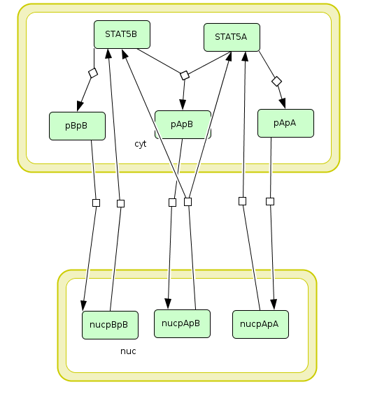
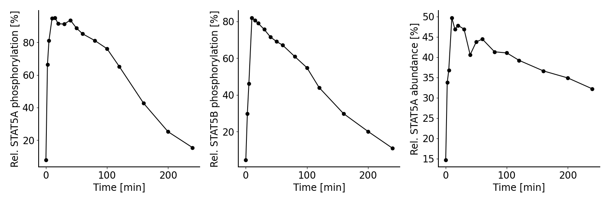
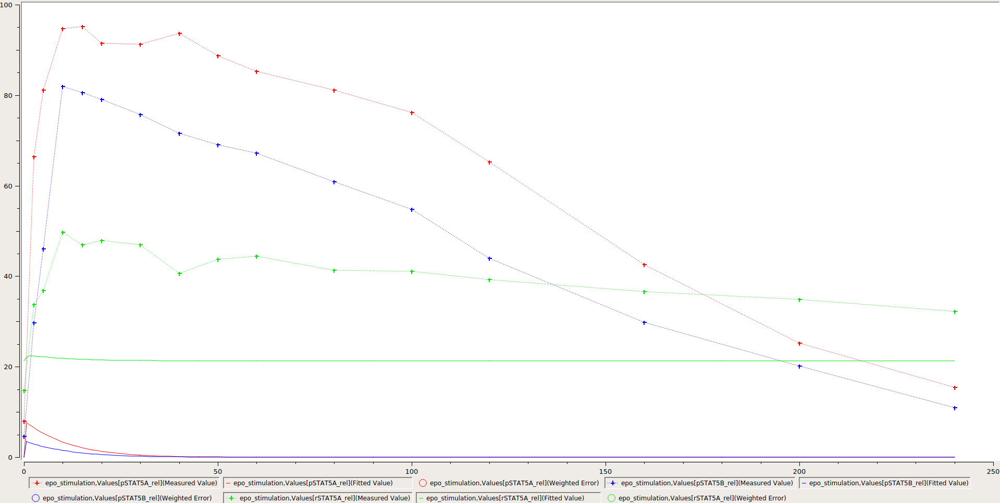

==============
PEtab Tutorial
==============

.. _Boehm et al. (2014): https://dx.doi.org/10.1021/pr5006923

Overview
++++++++

In the following, we demonstrate how to set up a parameter estimation
problem in PEtab based on a realistic application example. To this end,
we consider the model and experimental data by
`Boehm et al. (2014)`_. The
model describes the dynamics of phosphorylation and dimerization of the
transcription factors STAT5A and STAT5B. A visualization and the
corresponding reactions of the model are provided below, although the
details of the model are not relevant for the purpose of this tutorial.
For more details, we refer to the original publication.

A PEtab problem consists of 1) an SBML model of a biological system, 2)
condition, observable and measurement definitions, and 3) the
specification of the parameters. We will show how to generate the
respective files in the following.

1. The model
++++++++++++

PEtab assumes that an SBML file of the model exists. Here, we use the
SBML model provided in the original publication, which is also available
on Biomodels (https://www.ebi.ac.uk/biomodels/BIOMD0000000591). For
illustration purposes we slightly modified the SBML model and shortened
some parts of the PEtab files. The full PEtab problem introduced in this
tutorial is available `online <https://github.com/PEtab-dev/PEtab/tree/b50d000a5fb4cf37bf62315686acd2694e29e5fc/doc/tutorial>`_.

   Visualization of the model used as example in this tutorial.
   The model describes the dynamics of phosphorylation and dimerization of the
   transcription factors STAT5A and STAT5B.

.. table:: Reactions included in the example model.

    == ========================== =============================================
    ID Reaction                   Rate law
    == ========================== =============================================
    R1 2 STAT5A → pApA            cyt \* BaF3_Epo \* STAT5A^2 \* k_phos
    R2 STAT5A + STAT5B → pApB     cyt \* BaF3_Epo \* STAT5A \* STAT5B \* k_phos
    R3 2 STAT5B → pBpB            cyt \* BaF3_Epo \* STAT5B^2 \* k_phos
    R4 pApA → nucpApA             cyt \* k_imp_homo \* pApA
    R5 pApB → nucpApB             cyt \* k_imp_hetero \* pApB
    R6 pBpB → nucpBpB             cyt \* k_imp_homo \* pBpB
    R7 nucpApA → 2 STAT5A         nuc \* k_exp_homo \* nucpApA
    R8 nucpApB → STAT5A + STAT5B  nuc \* k_exp_hetero \* nucpApB
    R9 nucpBpB → 2 STAT5B         nuc \* k_exp_homo \* nucpBpB
    == ========================== =============================================

2. Linking model and measurements
+++++++++++++++++++++++++++++++++

The model by `Boehm et al. (2014)`_ was calibrated on measurements on
phosphorylation levels of STAT5A and STAT5B as well as relative STAT5A
abundance for different timepoints between 0 - 240 minutes after
stimulation with erythropoietin (Epo):

   Measurements considered for model calibration in our example.

To define a parameter estimation problem in PEtab, we need to map
measurements to the model states. To this end, we need to 1) specify the
experimental conditions the measurements were generated from, 2) specify
observation functions and error models, and 3) specify the measurements
themselves. For this, we need to define observation functions as well as
experimental conditions under which a measurement was performed.

2.1 Specifying experimental conditions
--------------------------------------

All measurements were collected under the same experimental condition,
which is a stimulation with Epo. This is specified in the experimental
condition PEtab file, a tab-separated values (TSV) file\ [#f1]_,
by providing a condition identifier and listing all condition-specific
parameters and their respective values.

In the problem considered here, the relevant parameter is
``Epo_concentration`` which we want to set to a value of 1.25E-7, as the
only condition-specific parameter. Since in this example we include data from
only one single experiment, it would not be necessary to specify the condition
parameter here, but instead the value could have been also set in the model or
in the parameter table. However, the benefit of specifying it in the condition
table is, that it allows us to easily add measurements from other
experiments performed with different Epo concentrations later on.

The condition table looks as follows:

.. table:: Conditions table ``experimental_conditions.tsv``.

    =============== ============================ =================
    conditionId     conditionName                Epo_concentration
    =============== ============================ =================
    epo_stimulation Stimulation with 1.25E-7 Epo 1.25E-7
    =============== ============================ =================

* *conditionId* is a unique identifier to define the different conditions
  and link them to the measurements (see measurement file below).
  Additional measurements e.g. for different Epo concentrations can be
  defined by adding new rows.

* *conditionName* can be used as a human readable description of the
  condition e.g. for plotting.

The following column headers (here *Epo_concentration*) refer to
different parameters or species in the model, the values of which are
overridden by these condition-specific values. Here, we define the Epo
concentration, but additional columns could be used to e.g. set
different initial concentrations of STAT5A/B. In addition to numeric
values, also parameter identifiers can be used here to introduce
condition specific estimateable parameters.

2.2 Specifying the observation model
------------------------------------

To link the model states to the measured values, we specify observation
functions. Additionally, a noise model can be introduced to account for
the measurement errors. In PEtab, this can be encoded in the observable
file:

.. list-table:: Observables table ``observables.tsv``.
   :header-rows: 1

   * - observableId
     - observableName
     - ...
   * - pSTAT5A_rel
     - Rel. STAT5A phosphorylation [%]
     - ...
   * - pSTAT5B_rel
     - Rel. STAT5B phosphorylation [%]
     - ...
   * - rSTAT5A_rel
     - Rel. STAT5A abundance [%]
     - ...

.. list-table:: Observables table ``observables.tsv`` (continued).
   :header-rows: 1

   * - ...
     - observableFormula
     - ...
   * - ...
     - 100*(2*pApA + pApB) / (2*pApA + pApB + STAT5A)
     - ...
   * - ...
     - 100*(2*pBpB + pApB) / (2*pBpB + pApB + STAT5B)
     - ...
   * - ...
     - 100*(STAT5A + pApB + 2*pApA) / (2 \* pApB + 2\* pApA + STAT5A + STAT5B + 2*pBpB)
     - ...

.. list-table:: Observables table ``observables.tsv`` (continued).
   :header-rows: 1

   * - ...
     - noiseFormula
     - noiseDistribution
   * - ...
     - noiseParameter1_pSTAT5A_rel
     - normal
   * - ...
     - noiseParameter1_pSTAT5B_rel
     - normal
   * - ...
     - noiseParameter1_rSTAT5A_rel
     - normal

* *observableId* specifies a unique identifier to the observables that can
  be used to link them to the measurements (see below).

* *observableName* can be used as a human readable description of the
  observable. Here, this corresponds to the y-label in the figure above.

* *observableFormula* is a mathematical expression defining how the model
  output is calculated. The formula can consist of species and parameters
  defined in the SBML file. In our example, we measure e.g. the relative
  phosphorylation level of STAT5A (*pSTAT5A_rel*), which is the sum of all
  species containing phosphorylated STAT5A over the sum of all species
  containing any form of STAT5A.

* *noiseFormula* is used to describe the formula for the measurement
  noise. Together with *noiseDistribution*, it defines the noise model. In
  this example, we assume additive, normally distributed measurement noise.
  In this scenario, ``noiseParameter1_{observableId}`` is the standard
  deviation of the measurement noise. Parameters following this naming
  scheme are expected to be overridden in a measurement-specific manner in
  the *noiseParameters* column of the measurement table (see below).

2.3 Specifying measurements
---------------------------

The experimental data is linked to the conditions via the *conditionId*
and to the observables via the *observableId*. This is defined in the
PEtab measurement file:

.. table:: Measurement table ``measurement_data.tsv``.

    ============ ===================== =========== ==== ===============
    observableId simulationConditionId measurement time noiseParameters
    ============ ===================== =========== ==== ===============
    pSTAT5A_rel  epo_stimulation       7.9         0    sd_pSTAT5A_rel
    ...          ...                   ...         ...  ...
    pSTAT5A_rel  epo_stimulation       15.4        240  sd_pSTAT5A_rel
    pSTAT5B_rel  epo_stimulation       4.6         0    sd_pSTAT5B_rel
    ...          ...                   ...         ...  ...
    pSTAT5B_rel  epo_stimulation       10.96       240  sd_pSTAT5B_rel
    rSTAT5A_rel  epo_stimulation       14.7        0    sd_rSTAT5A_rel
    ...          ...                   ...         ...  ...
    rSTAT5A_rel  epo_stimulation       32.2        240  sd_rSTAT5A_rel
    ============ ===================== =========== ==== ===============

* *observableId* references the *observableId* from the observable file.

* *simulationConditionId* references the *conditionId* from the
  experimental condition file.

* *measurement* defines the values that are measured for the respective
  observable and experimental condition.

* *time* is the time point at which the measurement was performed. For
  brevity, only the first and last time point of the example are shown
  here (the omitted measurements are indicated by “...” in the example).

* *noiseParameters* relates to the *noiseParameters* in the observables
  file. In our example, the measurement noise is unknown. Therefore we
  define parameters here which have to be estimated (see parameters sheet
  below). If the noise is known, e.g. from multiple replicates, numeric
  values can be used in this column.

3. Defining parameters
++++++++++++++++++++++

The model by `Boehm et al. (2014)`_ contains nine unknown parameters that
need to be estimated from the experimental data. Additionally, it has
one known parameter that is fixed to a literature value.

The parameters file for this is given by:

.. table:: Parameter table ``parameters.tsv``.

    ==================== ============== ========== ========== ============ ========
    parameterId          parameterScale lowerBound upperBound nominalValue estimate
    ==================== ============== ========== ========== ============ ========
    Epo_degradation_BaF3 log10          1E-5       1E+5       \            1
    k_exp_hetero         log10          1E-5       1E+5       \            1
    k_exp_homo           log10          1E-5       1E+5       \            1
    k_imp_hetero         log10          1E-5       1E+5       \            1
    k_imp_homo           log10          1E-5       1E+5       \            1
    k_phos               log10          1E-5       1E+5       \            1
    ratio                lin            \          \          0.693        0
    sd_pSTAT5A_rel       log10          1E-5       1E+5       \            1
    sd_pSTAT5B_rel       log10          1E-5       1E+5       \            1
    sd_rSTAT5A_rel       log10          1E-5       1E+5       \            1
    ==================== ============== ========== ========== ============ ========

* *parameterId* references parameters defined in the SBML file.
  Additionally, parameters defined in the measurement table can be used
  here. In this example, the standard deviations for the different
  observables (*sd_{observableId}*) are estimated.

* *parameterScale* is the scale on which parameters are estimated. Often,
  a logarithmic scale improves estimation. Alternatively, a linear scale
  can be used, e.g. when parameters can be negative.

* *lowerBound* and *upperBound* define the bounds for the parameters used
  during estimation. These are usually biologically plausible ranges.

* *nominalValue* are known values used for simulation. The entry can be
  left empty, if a value is unknown and requires estimation.

* *estimate* defines whether the parameter will be estimated (1)
  or be fixed (0) to the value in the nominalValue column.

4. Visualization file
+++++++++++++++++++++

Optionally, a visualization file can be specified in PEtab which defines
how the measurement data and potentially model simulations are plotted.
So far, the visualization files are only supported by the PEtab Python
library. Here, we describe a file that specifies the visualization of
the measurement data similar to the figure above.

.. table:: Visualization specification table ``visualization_specification.tsv``.

    ====== ============ ========== =========== ===============================
    plotId plotTypeData xLabel     yValues     yLabel
    ====== ============ ========== =========== ===============================
    plot1  MeanAndSD    Time [min] pSTAT5A_rel Rel. STAT5A phosphorylation [%]
    plot2  MeanAndSD    Time [min] pSTAT5B_rel Rel. STAT5B phosphorylation [%]
    plot3  MeanAndSD    Time [min] rSTAT5A_rel Rel. STAT5A abundance [%]
    ====== ============ ========== =========== ===============================

* *plotId* corresponds to a specific plot. All lines which share the same
  *plotId* are combined into one plot.

* *plotTypeData* defines the plotting style of the measurement data. Here,
  we use mean and (if available) standard deviations.

* *xLabel* and *yLabel* are the labels of the x- and y-axes for the
  corresponding plot.

* *yValues* defines what is plotted. In this example the different
  observables are plotted individually.

There are various ways of further individualizing the plots, e.g. by
defining legend entries or data plotted on log-scale (see the
documentation for further information
https://petab.readthedocs.io/en/latest/documentation_data_format.html#visualization-table).

5. YAML file
++++++++++++

To group the previously mentioned PEtab files, a YAML file can be used,
defining which files constitute a PEtab problem. While being optional,
this makes it easier to import a PEtab problem into tools, and allows
reusing files for different PEtab problems. This file has the following
format (``Boehm_JProteomeRes2014.yaml``):

.. code-block:: yaml

    format_version: 1
    parameter_file: parameters.tsv
    problems:
      - condition_files:
        - experimental_conditions.tsv
        measurement_files:
        - measurement_data.tsv
        observable_files:
        - observables.tsv
        sbml_files:
        - model_Boehm_JProteomeRes2014.xml
        visualization_files:
        - visualization_specification.tsv

The first line specifies the version this file and the files referenced
adhere to. The current version number is 1. The second line references
the parameter file. This is followed by a list of (sub-)problems, in
this case only one, referencing the respective condition, measurement
observable, model, and visualization files. There can be multiple of
those files, e.g. for large numbers of measurements, one could split
those up into separate files, e.g. by experimental condition or
observable.

6. Model simulation
+++++++++++++++++++

To simulate the model and compare it to the experimental data, the nominal
parameters in the parameters file need to be set. As some parameters are
a priori unknown, we here consider randomly sampled parameters to get a glance
of model behaviour and fit to the data.

.. table:: Parameter table ``parameters.tsv`` with *nominalValue* set to random values.

    ==================== ============== ========== ========== ============ ========
    parameterId          parameterScale lowerBound upperBound nominalValue estimate
    ==================== ============== ========== ========== ============ ========
    Epo_degradation_BaF3 log10          1E-5       1E+5       0.105        1
    k_exp_hetero         log10          1E-5       1E+5       1.85         1
    k_exp_homo           log10          1E-5       1E+5       9.83         1
    k_imp_hetero         log10          1E-5       1E+5       1048.96      1
    k_imp_homo           log10          1E-5       1E+5       10.136       1
    k_phos               log10          1E-5       1E+5       10.136       1
    ratio                lin            \          \          0.693        0
    sd_pSTAT5A_rel       log10          1E-5       1E+5       51.7         1
    sd_pSTAT5B_rel       log10          1E-5       1E+5       0.257        1
    sd_rSTAT5A_rel       log10          1E-5       1E+5       0.017        1
    ==================== ============== ========== ========== ============ ========

With this, the model can be simulated using the different tools that support
PEtab. The easiest tool to get started with is probably COPASI which comes
with a graphical user interface
(see https://github.com/copasi/python-petab-importer for further instructions).

   Visualization of model outputs after simulation with random parameters and
   measurements in COPASI.

It is apparent from the figure, that the random parameters yield a poor fit of
the model with the data. Therefore, it is important to optimize the parameters
to improve the model fit. This can be done using various parameter
estimation tools. Links to detailed descriptions how to use the individual
toolboxes are provided at the `PEtab Github page <https://github.com/PEtab-dev/PEtab#petab-support-in-systems-biology-tools>`_.

7. Further information
++++++++++++++++++++++

This tutorial only demonstrates a subset of PEtab functionality. For
full reference, consult the
`PEtab reference <https://petab.readthedocs.io/en/stable/>`_. After
finishing the implementation of the PEtab problem, its correctness can
be verified using the PEtab library (see
https://github.com/PEtab-dev/PEtab/blob/master/doc/example/example_petablint.ipynb
for instructions). The PEtab problem can then be used as input to the
supporting toolboxes to estimate the unknown parameters or calculate
parameter uncertainties. Links to tutorials for the different tools can
be found at the PEtab Github page
(https://github.com/PEtab-dev/PEtab#petab-support-in-systems-biology-tools).

.. [#f1]
   TSV files can be created using any standard spreadsheet application,
   or for small files, text editor.

References
++++++++++

* Martin E. Boehm, Lorenz Adlung, Marcel Schilling, Susanne Roth,
  Ursula Klingmüller, and Wolf D. Lehmann.
  *Journal of Proteome Research* **2014** 13 (12), 5685-5694.
  DOI: `10.1021/pr5006923 <https://dx.doi.org/10.1021/pr5006923>`_.
