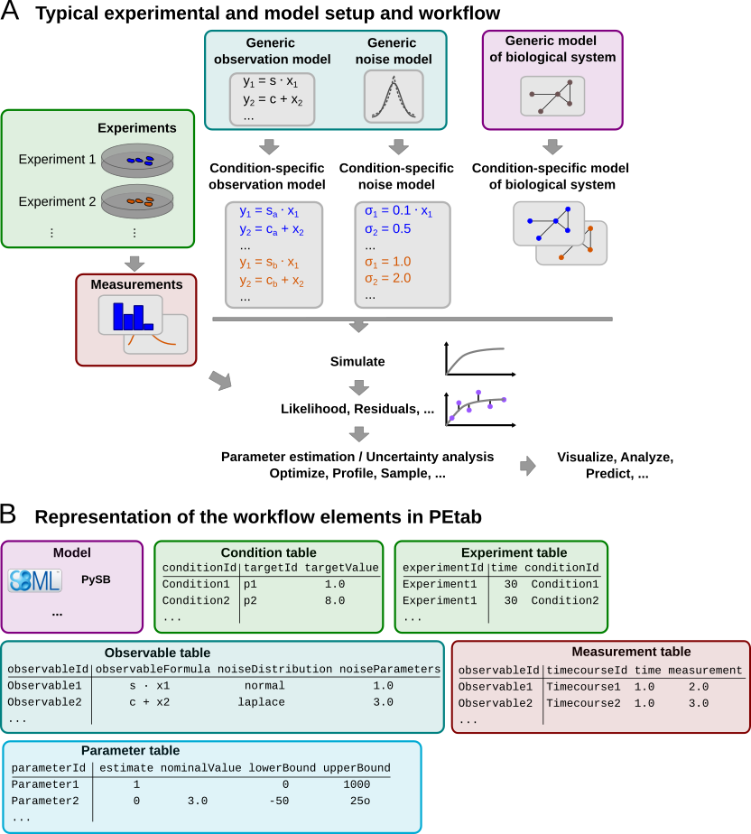
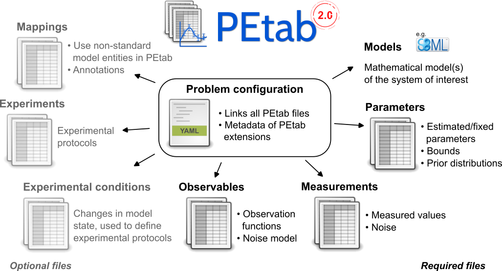

.. warning::

    This document is a draft and subject to change.

.. _v2_spec:

PEtab data format specification
===============================

Format version: 2.0.0

This document explains the PEtab data format.

Purpose
-------

Providing a standardized way for specifying parameter estimation problems in
systems biology, especially for the case of Ordinary Differential Equation
(ODE) models.

Scope
-----

The scope of PEtab is the full specification of parameter estimation problems
in typical systems biology applications. In our experience, a typical setup of
data-based modeling starts either with (i) the model of a biological system
that is to be calibrated, or with (ii) experimental data that are to be
integrated and analyzed using a computational model.
Measurements are linked to the biological model by an observation and noise
model. Often, measurements are taken after some perturbations have been
applied, which are modeled as derivations from a generic model
(Figure 1A). Therefore, one goal was to specify such a setup in the
least redundant way. Furthermore, we wanted to establish an intuitive, modular,
machine- and human-readable and -writable format that makes use of existing
standards.

   **Figure 1: A common setup for data-based modeling studies and its representation in PEtab.**

Overview
---------

The PEtab data format specifies a parameter estimation problem using a number
of text-based files (
`Tab-Separated Values (TSV) <https://www.iana.org/assignments/media-types/text/tab-separated-values>`_)
(Figure 2), i.e.:

- A model

- A measurement file to fit the model to [TSV]

- (optional) A conditions file specifying model inputs and condition-specific
  parameters [TSV]

- (optional) An experiments file describing a sequence of different
  experimental conditions that are applied to the model [TSV]

- An observables file specifying the observation model [TSV]

- A parameters file specifying estimatable parameters and related information
  [TSV]

- A grouping file that lists all of the files and provides additional information
  including employed extensions [YAML]

- (optional) A simulation file, which has the same format as the measurement
  file, but contains model simulations [TSV]

- (optional) A visualization file, which contains specifications how the data
  and/or simulations should be plotted by the visualization routines [TSV]

- (optional) A mapping file, which allows mapping PEtab entity IDs to entity
  IDs in the model, which might not have valid PEtab IDs themselves [TSV]

   **Figure 2: Files constituting a PEtab problem.**

Figure 1B shows how those files relate to a common setup for
data-based modeling studies.

The following sections will describe the minimum requirements of those
components in the core standard, which should provide all information for
defining the parameter estimation problem.

Extensions of this format (e.g. additional columns in the measurement table)
are possible and intended. However, while those columns may provide extra
information for example for plotting, downstream analysis, or for more
efficient parameter estimation, they should not affect the estimation
problem as such.

**General remarks**

- All model entities, column names and row names are case-sensitive
- Fields in "[]" are optional and may be left empty.
- The following data types are used in descriptions below:

  - ``STRING``: Any string
  - ``NUMERIC``: Any number excluding ``NaN`` / ``inf`` / ``-inf``
  - ``MATH_EXPRESSION``: A mathematical expression according to the
    `PEtab math expression syntax <math_expressions>`_.
  - ``PETAB_ID``: A string that is a valid PEtab ID
  - ``NON_PARAMETER_TABLE_ID``: A valid PEtab ID that refers to a constant or
    differential entity (:ref:`v2_model_entities`),
    including PEtab output parameters, but excluding parameters that are
    listed in the :ref:`v2_parameters_table`
    (independent of their ``estimate`` value).

Changes from PEtab 1.0.0
------------------------

PEtab 2.0.0 is a major update of the PEtab format. The main changes are:

* Support for non-SBML models (:ref:`v2_model`)
* Changed condition table format (wide -> long) (:ref:`v2_conditions_table`)
* ``simulationConditionId`` and ``preequilibrationConditionId`` in the
  :ref:`v2_measurements_table` are replaced by ``experimentId`` and a more
  flexible way for defining experiments / time courses
  (:ref:`v2_experiments_table`)
* Support for math expressions in the condition table (:ref:`v2_conditions_table`)
* Clarification and specification of various previously underspecified aspects
  (:ref:`v2_math_expressions`, overriding values via the condition table)
* Support for extensions
* Observable IDs are now allowed to be used in observable/noise formulas
  (:ref:`v2_observables_table`)

.. _v2_model:
.. _v2_model_entities:

Model definition
----------------

PEtab 2.0.0 is agnostic of specific model formats. A model file is referenced
in the PEtab problem description (YAML) via its file name or a URL.

In the following, we distinguish between three types of entities:

* **Differential entities**: Entities that are defined in terms of a
  time-derivative, e.g., the targets of SBML rate rules or species that
  change by participating in reactions (educts or products).

* **Algebraic entities**: Entities that are defined in terms of an algebraic
  assignment, i.e., they are not subject to time-derivative information, but
  are not generally constant, e.g., the targets of SBML assignment rules.

* **Constant entities**: Entities are that are defined in terms of a constant
  value but may be subject to event assignments, e.g., parameters of an SBML
  model that are not targets of rate rules or assignment rules.

.. _v2_conditions_table:

Conditions table
----------------

The conditions table specifies changes to parameters, initial or intermediate
values of species, and compartments, during specific time periods.
The start and end of the time period is defined in the
:ref:`v2_experiments_table`, where multiple conditions can be combined to
specify time courses or experiments that span multiple time periods.

The conditions table is specified as a tab-separated value file in the
following way:

+--------------+-------------------------+--------------------+
| conditionId  | targetId                | targetValue        |
+==============+=========================+====================+
| PETAB_ID     | NON_ESTIMATED_ENTITY_ID | MATH_EXPRESSION    |
+--------------+-------------------------+--------------------+
| e.g.         |                         |                    |
+--------------+-------------------------+--------------------+
| conditionId1 | modelEntityId1          | 0.42               |
+--------------+-------------------------+--------------------+
| conditionId1 | modelEntityId2          | 0.42               |
+--------------+-------------------------+--------------------+
| conditionId2 | modelEntityId1          | modelEntityId1 + 3 |
+--------------+-------------------------+--------------------+
| conditionId2 | someSpecies             | 8                  |
+--------------+-------------------------+--------------------+
| ...          | ...                     | ...                |
+--------------+-------------------------+--------------------+

Each row specifies one change in one target entity.
Row- and column-ordering are arbitrary, although specifying ``conditionId``
first may improve human readability.

Detailed field description
~~~~~~~~~~~~~~~~~~~~~~~~~~

- ``conditionId`` [PETAB_ID, REQUIRED]

  Unique identifier for the simulation/experimental condition, to be referenced
  by the :ref:`v2_experiments_table`.

- ``targetId``
  [NON_ESTIMATED_ENTITY_ID, REQUIRED]

  The ID of the entity that will change.
  The target must be a constant target or a differential target, and must not
  be listed in the :ref:`v2_parameters_table`.

- ``targetValue`` [MATH_EXPRESSION, REQUIRED]

  The value or expression that will be used to change the target.
  The current value of the target specified under ``targetId`` is initialized
  to the value of ``targetValue`` when the respective condition is applied.

  If the model has a concept of species and a species ID is provided, its
  value is interpreted as amount or concentration in the same way as anywhere
  else in the model.

.. _v2_reinitialization_semantics:

Detailed semantics
~~~~~~~~~~~~~~~~~~

All changes defined in the condition table are applied in five consecutive
phases, following the logic of a single SBML event assignment.

1. **Evaluation of** ``targetValues``

   ``targetValues`` are first evaluated using the *current* values of all
   variables in the respective expression.

   * For the initial time period of an experiment, *current* values are
     determined by the initial conditions defined in the model.

   * For subsequent time periods, the *current* values are defined by the
     simulation results at the end of the preceding time period.

2. **Assignment of the evaluated ``targetValues`` to their targets**

   All evaluated ``targetValues`` are simultaneously assigned to their
   corresponding targets.
   It is invalid to apply more than one assignment to a single target
   simultaneously.

   * This means that values of algebraic entities assigned by, e.g.,
     SBML assignment rules or PYSB expressions will need to be re-evaluated.

   * These assignments respect language specific interpretations of which
     variables are *atomic* or *derived*/*algebraic*.
     Most notably, SBML considers species amounts and compartment sizes
     but **not** concentrations to be *atomic*.
     This means that any entry that has a ``targetId`` that refers to a
     species with ``hasOnlySubstanceUnits=false`` will have its ``targetValue``
     (interpreted as concentration) converted to amounts using the **current**
     compartment size and then applied to the target's amount.
     For further details, refer to SBML semantic test suite case
     `01779 <https://github.com/sbmlteam/sbml-test-suite/blob/7ab011efe471877987b5d6dcba8cc19a6ff71254/cases/semantic/01779/01779-model.m>`_.

3. **Update of Derived Variables**

   After the assignment of the target values, all derived variables,
   i.e. algebraic entities, are updated.

   * These updates respect language specific interpretations of which variables
     are *atomic* or *derived*/*algebraic*.
     For example, SBML considers concentrations to be *derived*,
     meaning that species concentrations will be recomputed
     based on (updated) values of species amounts
     and corresponding compartment sizes.

4. **Events and Finalization**

   All other state- or time-dependent changes encoded in the model are now
   applied as well. For example, this includes SBML events.
   The model state for the evaluation of any trigger functions for this
   timepoint is the model state after (3).

   The initial model state for the new period at time = ``time``
   (:ref:`v2_experiments_table`) will be the model state after all of these
   changes.

5. **Evaluation of Observables**

   If there are measurements for the current timepoint, the observables are
   evaluated after all changes have been applied. This is the value that will
   be compared to the measurements in the measurement table.

.. _v2_measurements_table:

Measurement table
-----------------

A tab-separated values files containing all measurements to be used for
model training or validation.

Expected to have the following named columns in any (but preferably this)
order:

+--------------+--------------+-------------+--------------+
| observableId | experimentId | measurement | time         |
+==============+==============+=============+==============+
| PETAB_ID     | PETAB_ID     | NUMERIC     | NUMERIC\|inf |
+--------------+--------------+-------------+--------------+
| e.g.         |              |             |              |
+--------------+--------------+-------------+--------------+
| observable1  | experiment1  | 0.42        | 0            |
+--------------+--------------+-------------+--------------+
| ...          | ...          | ...         | ...          |
+--------------+--------------+-------------+--------------+

*(wrapped for readability)*

+-----+----------------------------------------------------+----------------------------------------------------+
| ... | [observableParameters]                             | [noiseParameters]                                  |
+=====+====================================================+====================================================+
| ... | [parameterId\|NUMERIC[;parameterId\|NUMERIC][...]] | [parameterId\|NUMERIC[;parameterId\|NUMERIC][...]] |
+-----+----------------------------------------------------+----------------------------------------------------+
| ... |                                                    |                                                    |
+-----+----------------------------------------------------+----------------------------------------------------+
| ... |                                                    |                                                    |
+-----+----------------------------------------------------+----------------------------------------------------+
| ... | ...                                                | ...                                                |
+-----+----------------------------------------------------+----------------------------------------------------+

Additional (non-standard) columns may be added. If the additional plotting
functionality of PEtab should be used, such columns could be

+-----+-------------+---------------+
| ... | [datasetId] | [replicateId] |
+=====+=============+===============+
| ... | [datasetId] | [replicateId] |
+-----+-------------+---------------+
| ... | ...         | ...           |
+-----+-------------+---------------+

where ``datasetId`` is a necessary column to use particular plotting
functionality, and ``replicateId`` is optional, which can be used to group
replicates and plot error bars.

Detailed field description
~~~~~~~~~~~~~~~~~~~~~~~~~~

- ``observableId`` [PETAB_ID, REQUIRED, REFERENCES(observables.observableID)]

  Observable ID as defined in the observable table described below.

- ``experimentId`` [PETAB_ID or empty, REQUIRED, REFERENCES(experimentsTable.experimentID)]

  Experiment ID as defined in the experiments table described below. This
  column may have empty cells, which are interpreted as *use the model as is*.
  This avoids the need for "dummy" conditions and experiments if only a single
  condition is required. If no experiment is specified, the model simulation
  is assumed to start at time 0, unless the model specifies a different
  initial time.

- ``measurement`` [NUMERIC, REQUIRED]

  The measured value in the same units/scale as the model output.

- ``time`` [NUMERIC OR ``inf``, REQUIRED]

  Time point of the measurement in the time unit specified in the employed model,
  a finite numeric value, or ``inf`` (lower-case) for steady-state
  measurements.

  If this time point coincides with the time point of a condition change,
  the condition change is applied before the observable is evaluated
  (see :ref:`v2_reinitialization_semantics` for details).

- ``observableParameters`` [NUMERIC, STRING OR NULL, OPTIONAL]

  This field allows overriding or introducing condition-specific versions of
  output parameters defined in the observation model. The model can define
  observables (see below) containing place-holder parameters which can be
  replaced by condition-specific dynamic or constant parameters. Placeholder
  parameters must be named ``observableParameter${n}_${observableId}``
  with ``n`` ranging from 1 (not 0) to the number of placeholders for the given
  observable, without gaps.
  If the observable specified under ``observableId`` contains no placeholders,
  this field must be empty. If it contains ``n > 0`` placeholders, this field
  must hold ``n`` semicolon-separated numeric values or parameter names. No
  trailing semicolon must be added.

  Different lines for the same ``observableId`` may specify different
  parameters. This may be used to account for condition-specific or
  batch-specific parameters. This will translate into an extended estimation
  parameter vector.

  All placeholders defined in the observation model must be overwritten here.
  If there are no placeholders used, this column may be omitted.

- ``noiseParameters`` [NUMERIC, STRING OR NULL, OPTIONAL]

  The measurement standard deviation or empty if the corresponding sigma is a
  model parameter.

  Numeric values or parameter names are allowed. Same rules apply as for
  ``observableParameters`` in the previous point.

- ``datasetId`` [STRING, OPTIONAL]

  The datasetId is used to group certain measurements to datasets. This is
  typically the case for data points which belong to the same observable,
  the same experiment, the same noise model,
  the same observable transformation and the same observable parameters.
  This grouping makes it possible to use the plotting routines that are
  provided by the PEtab Python library.

- ``replicateId`` [STRING, OPTIONAL]

  The replicateId can be used to discern replicates with the same
  ``datasetId``, which is helpful for plotting e.g. error bars.

.. _v2_experiments_table:

Experiments table
-----------------

The optional experiments table describes a sequence of different experimental
conditions (here: discrete changes) that are applied to the model. Only the
model state can be changed by the conditions in the experiments table, not
the model structure.

The experiments table is specified as a tab-separated value file in the
following way:

+---------------------+-------------------+-----------------+
| experimentId        | time              | conditionId     |
+=====================+===================+=================+
| PETAB_ID            | NUMERIC or '-inf' | CONDITION_ID    |
+---------------------+-------------------+-----------------+
| timecourse_1        |                 0 | condition_1     |
+---------------------+-------------------+-----------------+
| timecourse_1        |                10 | condition_2     |
+---------------------+-------------------+-----------------+
| timecourse_1        |               250 | condition_3     |
+---------------------+-------------------+-----------------+
| patient_3           |              -inf | condition_1     |
+---------------------+-------------------+-----------------+
| patient_3           |                 0 | condition_2     |
+---------------------+-------------------+-----------------+
| intervention_effect |               -20 | no_lockdown     |
+---------------------+-------------------+-----------------+
| intervention_effect |                20 | mild_lockdown   |
+---------------------+-------------------+-----------------+
| intervention_effect |                40 | severe_lockdown |
+---------------------+-------------------+-----------------+

Detailed field description
~~~~~~~~~~~~~~~~~~~~~~~~~~

The time courses table with three mandatory columns ``experimentId``,
``time``, and ``conditionId``:

- ``experimentId`` [PETAB_ID, REQUIRED]

  Identifier of the experiment.
  This is referenced by the ``experimentId`` column in the measurement table.

- ``time``: [NUMERIC or ``-inf``, REQUIRED]

  The time when the condition will become active, in the time unit specified
  in the model. ``-inf`` indicates that the respective condition will be
  simulated until a steady state is reached.

  If the simulation of a condition with steady fails to reach a steady state,
  and the condition is required for the evaluation of simulation at measurement
  points, the evaluation of the model is not well-defined.
  In such cases, PEtab interpreters should notify the user, for example, by
  returning ``NaN`` or ``inf`` values for the objective function.
  PEtab does not specify a numerical criterion for steady states.
  Any event triggers defined in the model must also be checked
  during this pre-simulation.

  Multiple conditions cannot be applied simultaneously in a single experiment,
  i.e. the ``time`` values must be unique for each ``experimentId``.
  The order of the rows is arbitrary, but specifying the rows in ascending order
  of time may improve human readability.

  ``time`` will override any initial time specified in the model.

- ``CONDITION_ID``:
  [PETAB_ID or empty, REQUIRED, REFERENCES(conditions.conditionID)]

  Reference to a condition ID in the condition table that
  is to be applied at the given ``time``, or empty to not apply any changes.

  Note: The time interval in which a condition is applied includes the
  respective starting timepoint, but excludes the starting timepoint of
  the following condition. This means that for an experiment where
  ``condition_A`` is applied at ``time_A`` and later ``condition_B`` is
  applied at ``time_B``, then ``condition_A`` is active
  during the interval ``[time_A, time_B)``. This implies that any event
  that triggers at ``time_B`` or is executed at ``time_B``
  (including events with delays) will trigger or will be executed *after*
  ``condition_B`` was applied,
  and for any measurements at ``time_B``, the observables will be
  evaluated *after* ``condition_B`` was applied. For further details, refer to
  :ref:`v2_reinitialization_semantics`.

Constructs that define initial values of model entities
(e.g., SBML's *initialAssignments*) are only applied once at the beginning of
the simulation, and are not re-evaluated at the beginning of each period.

.. _v2_observables_table:

Observables table
-----------------

Parameter estimation requires linking experimental observations to the model
of interest. Therefore, one needs to define observables (model outputs) and
respective noise models, which represent the measurement process.
Since parameter estimation is beyond the scope of SBML, there exists no
standard way to specify observables (model outputs) and respective noise
models. Therefore, in PEtab observables are specified in a separate table
as described in the following. This allows for a clear separation of the
observation model and the underlying dynamic model, which allows, in most
cases, to reuse any existing SBML model without modifications.

The observable table has the following columns:

+-----------------------+--------------------------------+-----------------------------------------------------------------------------+
| observableId          | [observableName]               | observableFormula                                                           |
+=======================+================================+=============================================================================+
| STRING                | [STRING]                       | STRING                                                                      |
+-----------------------+--------------------------------+-----------------------------------------------------------------------------+
| e.g.                  |                                |                                                                             |
+-----------------------+--------------------------------+-----------------------------------------------------------------------------+
| relativeTotalProtein1 | Relative abundance of Protein1 | observableParameter1_relativeTotalProtein1 * (protein1 + phospho_protein1 ) |
+-----------------------+--------------------------------+-----------------------------------------------------------------------------+
| ...                   | ...                            | ...                                                                         |
+-----------------------+--------------------------------+-----------------------------------------------------------------------------+

*(wrapped for readability)*

+-----+----------------------------+---------------------------------------+-----------------------+
| ... | [observableTransformation] | noiseFormula                          | [noiseDistribution]   |
+=====+============================+=======================================+=======================+
| ... | [lin(default)\|log\|log10] | STRING\|NUMBER                        | [laplace\|normal]     |
+-----+----------------------------+---------------------------------------+-----------------------+
| ... | e.g.                       |                                       |                       |
+-----+----------------------------+---------------------------------------+-----------------------+
| ... | lin                        | noiseParameter1_relativeTotalProtein1 | normal                |
+-----+----------------------------+---------------------------------------+-----------------------+
| ... | ...                        | ...                                   | ...                   |
+-----+----------------------------+---------------------------------------+-----------------------+

Detailed field description
~~~~~~~~~~~~~~~~~~~~~~~~~~

* ``observableId`` [STRING]

  Unique identifier for the given observable. Must consist only of upper and
  lower case letters, digits and underscores, and must not start with a digit.
  This is referenced by the ``observableId`` column in the measurement table.

* [``observableName``] [STRING, OPTIONAL]

  Name of the observable. Only used for output, not for identification.

* ``observableFormula`` [STRING]

  Observation function as plain text formula expression.
  May contain any symbol defined in the SBML model (including model time ``time``)
  or parameter table. In the simplest case just an SBML species ID
  or an ``AssignmentRule`` target. Additionally, any observable ID
  introduced in the observable table may be referenced, but circular definitions
  must be avoided.

  May introduce new parameters of the form ``observableParameter${n}_${observableId}``,
  which are overridden by ``observableParameters`` in the measurement table
  (see description there).

- ``observableTransformation`` [STRING, OPTIONAL]

  Transformation of the observable and measurement for computing the objective
  function. Must be one of ``lin``, ``log`` or ``log10``. Defaults to ``lin``.
  The measurements and model outputs are both assumed to be provided in linear
  space.

* ``noiseFormula`` [NUMERIC|STRING]

  Measurement noise can be specified as a numerical value which will
  default to a Gaussian noise model if not specified differently in
  ``noiseDistribution`` with standard deviation as provided here. In this case,
  the same standard deviation is assumed for all measurements for the given
  observable.

  Alternatively, some formula expression can be provided to specify
  more complex noise models. The formula may reference any uniquely identifiable
  model entity with PEtab-compatible identifier or any observable ID
  specified in the observable table.

  A noise model which accounts for relative and
  absolute contributions could, e.g., be defined as::

    noiseParameter1_observable_pErk + noiseParameter2_observable_pErk * observable_pErk

  with ``noiseParameter1_observable_pErk`` denoting the absolute and
  ``noiseParameter2_observable_pErk`` the relative contribution for the
  observable ``observable_pErk`` corresponding to species ``pErk``.
  IDs of noise parameters
  that need to have different values for different measurements have the
  structure: ``noiseParameter${indexOfNoiseParameter}_${observableId}``
  to facilitate automatic recognition. The specific values or parameters are
  assigned in the ``noiseParameters`` field of the *measurement table*
  (see above). Any parameters named ``noiseParameter${1..n}_${observableId}``
  *must* be overwritten in the measurement table.

  Noise formulae can also contain observable parameter overrides, which are
  described under ``observableFormula`` in this table. An example is when an
  observable formula contains an override, and a proportional noise model is
  used, which means the observable formula also appears in the noise formula.

- ``noiseDistribution`` [STRING: 'normal' or 'laplace', OPTIONAL]

  Assumed noise distribution for the given measurement. Only normally or
  Laplace distributed noise is currently allowed (log-normal and
  log-Laplace are obtained by setting ``observableTransformation`` to ``log``, similarly for ``log10``).
  Defaults to ``normal``. If ``normal``, the specified ``noiseParameters`` will be
  interpreted as standard deviation (*not* variance). If ``Laplace`` ist specified, the specified ``noiseParameter`` will be interpreted as the scale, or diversity, parameter.

Noise distributions
~~~~~~~~~~~~~~~~~~~

For ``noiseDistribution``, ``normal`` and ``laplace`` are supported. For ``observableTransformation``, ``lin``, ``log`` and ``log10`` are supported. Denote by :math:`y` the simulation, :math:`m` the measurement, and :math:`\sigma` the standard deviation of a normal, or the scale parameter of a laplace model, as given via the ``noiseFormula`` field. Then we have the following effective noise distributions.

- Normal distribution:

  .. math::
     \pi(m|y,\sigma) = \frac{1}{\sqrt{2\pi}\sigma}\exp\left(-\frac{(m-y)^2}{2\sigma^2}\right)

- Log-normal distribution (i.e. log(m) is normally distributed):

  .. math::
     \pi(m|y,\sigma) = \frac{1}{\sqrt{2\pi}\sigma m}\exp\left(-\frac{(\log m - \log y)^2}{2\sigma^2}\right)

- Log10-normal distribution (i.e. log10(m) is normally distributed):

  .. math::
     \pi(m|y,\sigma) = \frac{1}{\sqrt{2\pi}\sigma m \log(10)}\exp\left(-\frac{(\log_{10} m - \log_{10} y)^2}{2\sigma^2}\right)

- Laplace distribution:

  .. math::
     \pi(m|y,\sigma) = \frac{1}{2\sigma}\exp\left(-\frac{|m-y|}{\sigma}\right)

- Log-Laplace distribution (i.e. log(m) is Laplace distributed):

  .. math::
     \pi(m|y,\sigma) = \frac{1}{2\sigma m}\exp\left(-\frac{|\log m - \log y|}{\sigma}\right)

- Log10-Laplace distribution (i.e. log10(m) is Laplace distributed):

  .. math::
     \pi(m|y,\sigma) = \frac{1}{2\sigma m \log(10)}\exp\left(-\frac{|\log_{10} m - \log_{10} y|}{\sigma}\right)

The distributions above are for a single data point. For a collection :math:`D=\{m_i\}_i` of data points and corresponding simulations :math:`Y=\{y_i\}_i` and noise parameters :math:`\Sigma=\{\sigma_i\}_i`, the current specification assumes independence, i.e. the full distributions is

.. math::
   \pi(D|Y,\Sigma) = \prod_i\pi(m_i|y_i,\sigma_i)

.. _v2_parameters_table:

Parameter table
---------------

A tab-separated value text file containing information on model parameters.

This table *must* include the following parameters:

- Named parameter overrides introduced in the *conditions table*,
  unless defined in the SBML model
- Named parameter overrides introduced in the *measurement table*

and *must not* include:

- Placeholder parameters (see ``observableParameters`` and ``noiseParameters``
  above)
- Parameters included as column names in the *condition table*
- "Parameters" that are not *constant* entities (e.g., in an SBML model,
  the targets of *AssignmentRules* or *EventAssignments*)
- SBML *local* parameters

it *may* include:

- Any SBML model parameter that was not excluded above
- Named parameter overrides introduced in the *conditions table*

One row per parameter with arbitrary order of rows and columns:

+-------------+-----------------+-------------------------+-------------+------------+--------------+----------+-----+
| parameterId | [parameterName] | parameterScale          | lowerBound  | upperBound | nominalValue | estimate | ... |
+=============+=================+=========================+=============+============+==============+==========+=====+
| STRING      | [STRING]        | log10\|lin\|log         | NUMERIC     | NUMERIC    | NUMERIC      | 0\|1     | ... |
+-------------+-----------------+-------------------------+-------------+------------+--------------+----------+-----+
| ...         | ...             | ...                     | ...         | ...        | ...          | ...      | ... |
+-------------+-----------------+-------------------------+-------------+------------+--------------+----------+-----+

*(wrapped for readability)*

+-----+---------------------------+---------------------------------+----------------------+----------------------------+
| ... | [initializationPriorType] | [initializationPriorParameters] | [objectivePriorType] | [objectivePriorParameters] |
+=====+===========================+=================================+======================+============================+
| ... | *see below*               | *see below*                     | *see below*          | *see below*                |
+-----+---------------------------+---------------------------------+----------------------+----------------------------+
| ... | ...                       | ...                             | ...                  | ...                        |
+-----+---------------------------+---------------------------------+----------------------+----------------------------+

Additional columns may be added.

Detailed field description
~~~~~~~~~~~~~~~~~~~~~~~~~~

- ``parameterId`` [PETAB_ID, REQUIRED]

  The ``parameterId`` of the parameter described in this row. This has to match
  the ID of a parameter specified in the SBML model, a parameter introduced
  as override in the condition table, or a parameter occurring in the
  ``observableParameters`` or ``noiseParameters`` column of the measurement table
  (see above).

- ``parameterName`` [STRING, OPTIONAL]

  Parameter name to be used e.g. for plotting etc. Can be chosen freely. May
  or may not coincide with the SBML parameter name.

- ``parameterScale`` [lin|log|log10]

  Scale of the parameter to be used during parameter estimation.

  ``lin``
    Use the parameter value, ``lowerBound``, ``upperBound``, and
    ``nominalValue`` without transformation.
  ``log``
    Take the natural logarithm of the parameter value, ``lowerBound``,
    ``upperBound``, and ``nominalValue`` during parameter estimation.
  ``log10``
    Take the logarithm to base 10 of the parameter value, ``lowerBound``,
    ``upperBound``, and ``nominalValue`` during parameter estimation.

- ``lowerBound`` [NUMERIC]

  Lower bound of the parameter used for estimation.
  Optional, if ``estimate==0``.
  The provided value should be untransformed, as it will be transformed
  according to ``parameterScale`` during parameter estimation.

- ``upperBound`` [NUMERIC]

  Upper bound of the parameter used for estimation.
  Optional, if ``estimate==0``.
  The provided value should be untransformed, as it will be transformed
  according to ``parameterScale`` during parameter estimation.

- ``nominalValue`` [NUMERIC]

  Some parameter value to be used if
  the parameter is not subject to estimation (see ``estimate`` below).
  The provided value should be untransformed, as it will be transformed
  according to ``parameterScale`` during parameter estimation.
  Optional, unless ``estimate==0``.

- ``estimate`` [BOOL 0|1]

  1 or 0, depending on, if the parameter is estimated (1) or set to a fixed
  value(0) (see ``nominalValue``).

- ``initializationPriorType`` [STRING, OPTIONAL]

  Prior types used for sampling of initial points for estimation. Sampled
  points are clipped to lie inside the parameter boundaries specified by
  ``lowerBound`` and ``upperBound``. Defaults to ``parameterScaleUniform``.

  This is a hint for the optimization algorithm to start the optimization
  process or for re-sampling random points. The initialization prior does not
  change the objective function itself. Optimizers may choose to ignore this
  information.

  Possible prior types are:

    - *uniform*: flat prior on linear parameters
    - *normal*: Gaussian prior on linear parameters
    - *laplace*: Laplace prior on linear parameters
    - *logNormal*: exponentiated Gaussian prior on linear parameters
    - *logLaplace*: exponentiated Laplace prior on linear parameters
    - *parameterScaleUniform* (default): Flat prior on original parameter
      scale (equivalent to "no prior")
    - *parameterScaleNormal*: Gaussian prior on original parameter scale
    - *parameterScaleLaplace*: Laplace prior on original parameter scale

- ``initializationPriorParameters`` [STRING, OPTIONAL]

  Prior parameters used for sampling of initial points for estimation,
  separated by a semicolon. Defaults to ``lowerBound;upperBound``.
  The parameters are expected to be in linear scale except for the
  ``parameterScale`` priors, where the prior parameters are expected to be
  in parameter scale.

  So far, only numeric values will be supported, no parameter names.
  Parameters for the different prior types are:

    - uniform: lower bound; upper bound
    - normal: mean; standard deviation (**not** variance)
    - laplace: location; scale
    - logNormal: parameters of corresp. normal distribution (see: normal)
    - logLaplace: parameters of corresp. Laplace distribution (see: laplace)
    - parameterScaleUniform: lower bound; upper bound
    - parameterScaleNormal: mean; standard deviation (**not** variance)
    - parameterScaleLaplace: location; scale

- ``objectivePriorType`` [STRING, OPTIONAL]

  Prior types used for the objective function during estimation.
  For possible values, see ``initializationPriorType``.

- ``objectivePriorParameters`` [STRING, OPTIONAL]

  Prior parameters used for the objective function during estimation.
  For more detailed documentation, see ``initializationPriorParameters``.

.. _v2_visualization_table:

Visualization table
-------------------

A tab-separated value file containing the specification of the visualization
routines which come with the PEtab repository. Plots are in general
collections of different datasets as specified using their ``datasetId`` (if
provided) inside the measurement table.

Expected to have the following columns in any (but preferably this)
order:

+--------+------------+-------------------------------------------+------------------------------------------------------+
| plotId | [plotName] | [plotTypeSimulation]                      | [plotTypeData]                                       |
+========+============+===========================================+======================================================+
| STRING | [STRING]   | [LinePlot(default)\|BarPlot\|ScatterPlot] | [MeanAndSD(default)\|MeanAndSEM\|replicate;provided] |
+--------+------------+-------------------------------------------+------------------------------------------------------+
| ...    | ...        | ...                                       | ...                                                  |
+--------+------------+-------------------------------------------+------------------------------------------------------+

*(wrapped for readability)*

+-----+-------------+-------------------------------------+-----------+----------+--------------------------+
| ... | [datasetId] | [xValues]                           | [xOffset] | [xLabel] | [xScale]                 |
+=====+=============+=====================================+===========+==========+==========================+
| ... | [datasetId] | [time(default)\|parameterOrStateId] | [NUMERIC] | [STRING] | [lin\|log\|log10\|order] |
+-----+-------------+-------------------------------------+-----------+----------+--------------------------+
| ... | ...         | ...                                 | ...       | ...      | ...                      |
+-----+-------------+-------------------------------------+-----------+----------+--------------------------+

*(wrapped for readability)*

+-----+----------------+-----------+----------+-------------------+---------------+
| ... | [yValues]      | [yOffset] | [yLabel] | [yScale]          | [legendEntry] |
+=====+================+===========+==========+===================+===============+
| ... | [observableId] | [NUMERIC] | [STRING] | [lin\|log\|log10] | [STRING]      |
+-----+----------------+-----------+----------+-------------------+---------------+
| ... | ...            | ...       | ...      | ...               | ...           |
+-----+----------------+-----------+----------+-------------------+---------------+

Detailed field description
~~~~~~~~~~~~~~~~~~~~~~~~~~

- ``plotId`` [STRING, REQUIRED]

  An ID which corresponds to a specific plot. All datasets with the same
  plotId will be plotted into the same axes object.

- ``plotName`` [STRING, OPTIONAL]

  A name for the specific plot.

- ``plotTypeSimulation`` [STRING, OPTIONAL]

  The type of the corresponding plot, can be ``LinePlot``, ``BarPlot`` and ``ScatterPlot``. Default is ``LinePlot``.

- ``plotTypeData`` [STRING, OPTIONAL]

  The type how replicates should be handled, can be ``MeanAndSD``,
  ``MeanAndSEM``, ``replicate`` (for plotting all replicates separately), or
  ``provided`` (if numeric values for the noise level are provided in the
  measurement table). Default is ``MeanAndSD``.

- ``datasetId`` [STRING, REFERENCES(measurementTable.datasetId), OPTIONAL]

  The datasets which should be grouped into one plot.

- ``xValues`` [STRING, OPTIONAL]

  The independent variable, which will be plotted on the x-axis. Can be
  ``time`` (default, for time resolved data), or it can be ``parameterOrStateId``
  for dose-response plots. The corresponding numeric values will be shown on
  the x-axis.

- ``xOffset`` [NUMERIC, OPTIONAL]

  Possible data-offsets for the independent variable (default is ``0``).

- ``xLabel`` [STRING, OPTIONAL]

  Label for the x-axis. Defaults to the entry in ``xValues``.

- ``xScale`` [STRING, OPTIONAL]

  Scale of the independent variable, can be ``lin``, ``log``, ``log10`` or ``order``.
  The ``order`` value should be used if values of the independent variable are
  ordinal. This value can only be used in combination with ``LinePlot`` value for
  the ``plotTypeSimulation`` column. In this case, points on x axis will be
  placed equidistantly from each other. Default is ``lin``.

- ``yValues`` [observableId, REFERENCES(measurementTable.observableId), OPTIONAL]

  The observable which should be plotted on the y-axis.

- ``yOffset`` [NUMERIC, OPTIONAL]

  Possible data-offsets for the observable (default is ``0``).

- ``yLabel`` [STRING, OPTIONAL]

  Label for the y-axis. Defaults to the entry in ``yValues``.

- ``yScale`` [STRING, OPTIONAL]

  Scale of the observable, can be ``lin``, ``log``, or ``log10``. Default is ``lin``.

- ``legendEntry`` [STRING, OPTIONAL]

  The name that should be displayed for the corresponding dataset in the
  legend and which defaults to the value in ``datasetId``.

.. _v2_mapping_table:

Mapping table
-------------

The mapping table maps PEtab entity IDs to model entity IDs, and may be used
for additional annotations. This file is optional.

This file may be used to provide PEtab-compatible aliases to model entities
whose ID in the model would not be a valid identifier in PEtab
(e.g., due to inclusion of blanks, dots, or other special characters),
and thus, would not be allowed in the PEtab problem files.

The TSV file has two mandatory columns, ``petabEntityId`` and
``modelEntityId``. Additional columns are allowed.

+---------------+---------------+---------------+
| petabEntityId | modelEntityId | [name]        |
+===============+===============+===============+
| STRING        | STRING        | STRING        |
+---------------+---------------+---------------+
| reaction1_k1  | reaction1.k1  | reaction1 k1  |
+---------------+---------------+---------------+

Detailed field description
~~~~~~~~~~~~~~~~~~~~~~~~~~

- ``petabEntityId`` [PETAB_ID, REQUIRED]

  A valid PEtab identifier (see :ref:`v2_identifiers`) that is not defined in
  any other part of the PEtab problem.
  This identifier may be referenced in condition, measurement, parameter and
  observable tables, but cannot be referenced in the model itself.

  The ``petabEntityId`` may be the same as the ``modelEntityId``, but it must
  not be used to alias an entity that already has a valid PEtab identifier.
  This restriction is to avoid unnecessary complexity in the PEtab problem
  files.

- ``modelEntityId`` [STRING or empty, REQUIRED]

  A globally unique identifier defined in the model, or empty if the entity is
  not present in the model. This does not have to be a valid PEtab identifier.
  Rows with empty ``modelEntityId`` serve as annotations only.

  For example, in SBML, local parameters may be referenced as
  ``$reactionId.$localParameterId``, which are not valid PEtab IDs as they
  contain a ``.`` character. Similarly, this table may be used to reference
  specific species in a BNGL model that may contain many unsupported
  characters such as ``,``, ``(`` or ``.``. However, please note that IDs must
  exactly match the species names in the BNGL-generated network file, and no
  pattern matching will be performed.

- ``name`` [STRING or empty, OPTIONAL]

  A human-readable name for the entity. This is optional and may be used for
  reporting or visualization purposes.
  Any tool making use of this value should default to the ``petabEntityId``
  if this field is empty.

Extensions
~~~~~~~~~~

Additional columns, such as ``Color``, etc. may be specified. Extensions
that define operations on multiple PEtab problems need to employ a single
PEtab YAML file as entrypoint to the analysis. This PEtab file may leave all
fields specifying files empty and reference the other PEtab problems in the
extension specific fields.

Examples
~~~~~~~~

Examples of the visualization table can be found in the
`Benchmark model collection <https://github.com/Benchmarking-Initiative/Benchmark-Models-PEtab/>`_, for example in the `Chen_MSB2009 <https://github.com/Benchmarking-Initiative/Benchmark-Models-PEtab/tree/master/Benchmark-Models/Chen_MSB2009>`_
model.

.. _v2_problem_yaml:

YAML file for grouping files
----------------------------

To link the model, measurement table, condition table, etc. in an
unambiguous way, we use a `YAML <https://yaml.org/>`_ file.

This file also allows specifying a PEtab version and employed PEtab extensions.

Furthermore, this can be used to describe parameter estimation problems
comprising multiple models (more details below).

The format is described in the
`jsonschema <../_static/petab_schema_v2.yaml>`_, which allows for
easy validation:

.. literalinclude:: _static/petab_schema_v2.yaml
   :language: yaml

Parameter estimation problems combining multiple models
~~~~~~~~~~~~~~~~~~~~~~~~~~~~~~~~~~~~~~~~~~~~~~~~~~~~~~~

Parameter estimation problems can comprise multiple models. For now, PEtab
allows one to specify multiple models with corresponding condition and
measurement tables, and one joint parameter table. This means that the parameter
namespace is global. Therefore, parameters with the same ID in different models
will be considered identical.

.. _v2_math_expressions:

Math expressions syntax
-----------------------

This section describes the syntax of math expressions used in PEtab files, such
as the observable formulas.

Supported symbols, literals, and operations are described in the following. Whitespace is ignored in math expressions.

Symbols
~~~~~~~

* The supported identifiers are:

  * parameter IDs from the parameter table
  * model entity IDs that are globally unique and have a clear interpretation
    in a math expression context
  * observable IDs from the observable table
  * PEtab placeholder IDs in the observable and noise formulas
  * PEtab entity IDs in the mapping table
  * ``time`` for the model time
  * PEtab function names listed below

 Identifiers are not supported if they do not match the PEtab identifier
 format. PEtab expressions may have further context-specific restrictions on
 supported identifiers.

* The functions defined in PEtab are tabulated below. Other functions,
  including those defined in the model, remain undefined in PEtab expressions.

* Special symbols (such as :math:`e` and :math:`\pi`) are not supported, and
  neither is NaN (not-a-number).

Model time
++++++++++

The model time is represented by the symbol ``time``, which is the current
simulated time, not the current duration of simulated time; if the simulation
starts at :math:`t_0 \neq 0`, then ``time`` is *not* the time since
:math:`t_0`.

Literals
~~~~~~~~

Numbers
+++++++

All numbers, including integers, are treated as floating point numbers of
undefined precision (although no less than double precision should be used.
Only decimal notation is supported. Scientific notation
is supported, with the exponent indicated by ``e`` or ``E``. The decimal
separator is indicated by ``.``.
Examples of valid numbers are: ``1``, ``1.0``, ``-1.0``, ``1.0e-3``, ``1.0e3``,
``1e+3``. The general syntax in PCRE2 regex is ``\d*(\.\d+)?([eE][-+]?\d+)?``.
``inf`` and ``-inf`` are supported as positive and negative infinity.

Booleans
++++++++

Boolean literals are ``true`` and ``false``.

Operations
~~~~~~~~~~

Operators
+++++++++

The supported operators are:

.. list-table:: Supported operators in PEtab math expressions.
   :header-rows: 1

   * - Operator
     - Precedence
     - Interpretation
     - Associativity
     - Arguments
     - Evaluates to
   * - ``f(arg1[, arg2, ...])``
     - 1
     - call to function `f` with arguments `arg1`, `arg2`, ...
     - left-to-right
     - any
     - input-dependent
   * - | ``()``
       |
     - | 1
       |
     - | parentheses for grouping
       | acts like identity
     - |
       |
     - | any single expression
       |
     - | argument
       |
   * - | ``^``
       |
     - | 2
       |
     - | exponentiation
       | (shorthand for pow)
     - | right-to-left
       |
     - | float, float
       |
     - | float
       |
   * - | ``+``
       | ``-``
     - | 3
     - | unary plus
       | unary minus
     - | right-to-left
     - | float
     - | float
   * - ``!``
     - 3
     - not
     -
     - bool
     - bool
   * - | ``*``
       | ``/``
     - | 4
     - | multiplication
       | division
     - | left-to-right
     - | float, float
     - | float
   * - | ``+``
       | ``-``
     - | 5
     - | binary plus, addition
       | binary minus, subtraction
     - | left-to-right
     - | float, float
     - | float
   * - | ``<``
       | ``<=``
       | ``>``
       | ``>=``
     - | 6
     - | less than
       | less than or equal to
       | greater than
       | greater than or equal to
     - | left-to-right
     - | float, float
     - | bool
   * - | ``==``
       | ``!=``
     - | 6
     - | is equal to
       | is not equal to
     - | left-to-right
     - | (float, float) or (bool, bool)
     - | bool
   * - | ``&&``
       | ``||``
     - | 7
     - | logical `and`
       | logical `or`
     - | left-to-right
     - | bool, bool
     - | bool
   * - ``,``
     - 8
     - function argument separator
     - left-to-right
     - any
     -

Note that operator precedence might be unexpected, compared to other programming
languages. Use parentheses to enforce the desired order of operations.

Operators must be specified; there are no implicit operators.
For example, ``a b`` is invalid, unlike ``a * b``.

.. _v2_math_functions:

Functions
+++++++++

The following functions are supported:

..
   START TABLE Supported functions (GENERATED, DO NOT EDIT, INSTEAD EDIT IN PEtab/doc/src)
.. list-table:: Supported functions
   :header-rows: 1

   * - | Function
     - | Comment
     - | Argument types
     - | Evaluates to
   * - ``pow(a, b)``
     - power function `b`-th power of `a`
     - float, float
     - float
   * - ``exp(x)``
     - | exponential function pow(e, x)
       | (`e` itself not a supported symbol,
       | but ``exp(1)`` can be used instead)
     - float
     - float
   * - ``sqrt(x)``
     - | square root of ``x``
       | ``pow(x, 0.5)``
     - float
     - float
   * - | ``log(a, b)``
       | ``log(x)``
       | ``ln(x)``
       | ``log2(x)``
       | ``log10(x)``
     - | logarithm of ``a`` with base ``b``
       | ``log(x, e)``
       | ``log(x, e)``
       | ``log(x, 2)``
       | ``log(x, 10)``
       | (``log(0)`` is defined as ``-inf``)
       | (NOTE: ``log`` without explicit
       | base is ``ln``, not ``log10``)
     - float[, float]
     - float
   * - | ``sin``
       | ``cos``
       | ``tan``
       | ``cot``
       | ``sec``
       | ``csc``
     - trigonometric functions
     - float
     - float
   * - | ``arcsin``
       | ``arccos``
       | ``arctan``
       | ``arccot``
       | ``arcsec``
       | ``arccsc``
     - inverse trigonometric functions
     - float
     - float
   * - | ``sinh``
       | ``cosh``
       | ``tanh``
       | ``coth``
       | ``sech``
       | ``csch``
     - hyperbolic functions
     - float
     - float
   * - | ``arcsinh``
       | ``arccosh``
       | ``arctanh``
       | ``arccoth``
       | ``arcsech``
       | ``arccsch``
     - inverse hyperbolic functions
     - float
     - float
   * - | ``piecewise(``
       |     ``true_value_1,``
       |       ``condition_1,``
       |     ``[true_value_2,``
       |       ``condition_2,]``
       |     ``[...]``
       |     ``[true_value_n,``
       |       ``condition_n,]``
       |     ``otherwise``
       | ``)``
     - | The function value is
       | the ``true_value*`` for the
       | first ``true`` ``condition*``
       | or ``otherwise`` if all
       | conditions are ``false``.
     - | ``*value*``: all float or all bool
       | ``condition*``: all bool
     - float
   * - ``abs(x)``
     - | absolute value
       | ``piecewise(x, x>=0, -x)``
     - float
     - float
   * - ``sign(x)``
     - | sign of ``x``
       | ``piecewise(1, x > 0, -1, x < 0, 0)``
     - float
     - float
   * - | ``min(a, b)``
       | ``max(a, b)``
     - | minimum / maximum of {``a``, ``b``}
       | ``piecewise(a, a<=b, b)``
       | ``piecewise(a, a>=b, b)``
     - float, float
     - float

..
   END TABLE Supported functions

Boolean <-> float conversion
++++++++++++++++++++++++++++

Boolean and float values are implicitly convertible. The following rules apply:

bool -> float: ``true`` is converted to ``1.0``, ``false`` is converted to
``0.0``.

float -> bool: ``0.0`` is converted to ``false``, all other values are
converted to ``true``.

Operands and function arguments are implicitly converted as needed. If there is
no signature compatible with the given types, Boolean
values are promoted to float. If there is still no compatible signature,
float values are demoted to boolean values. For example, in ``1 + true``,
``true`` is promoted to ``1.0`` and the expression is interpreted as
``1.0 + 1.0 = 2.0``, whereas in ``1 && true``, ``1`` is demoted to ``true`` and
the expression is interpreted as ``true && true = true``.

.. _v2_identifiers:

Identifiers
-----------

* All identifiers in PEtab may only contain upper and lower case letters,
  digits and underscores, and must not start with a digit. In PCRE2 regex, they
  must match ``[a-zA-Z_][a-zA-Z_\d]*``.

* Identifiers are case-sensitive.

* Identifiers must not be a reserved keyword (see below).

* Identifiers must be globally unique within the PEtab problem.
  PEtab does not put any further restrictions on the use of
  identifiers within the model, which means modelers could potentially
  use model-format--specific (e.g. SBML) function names as identifiers.
  However, this is strongly discouraged.

Reserved keywords
~~~~~~~~~~~~~~~~~

The following keywords, `case-insensitive`, are reserved and must not be used
as identifiers:

* ``true``, ``false``: Boolean literals, used in PEtab expressions.
* ``inf``: Infinity, used in PEtab expressions and for steady-state
  measurements
* ``time``: Model time, used in PEtab expressions.
* ``nan``: Undefined in PEtab, but reserved to avoid implementation issues.
* PEtab math function names (:ref:`v2_math_functions`)
