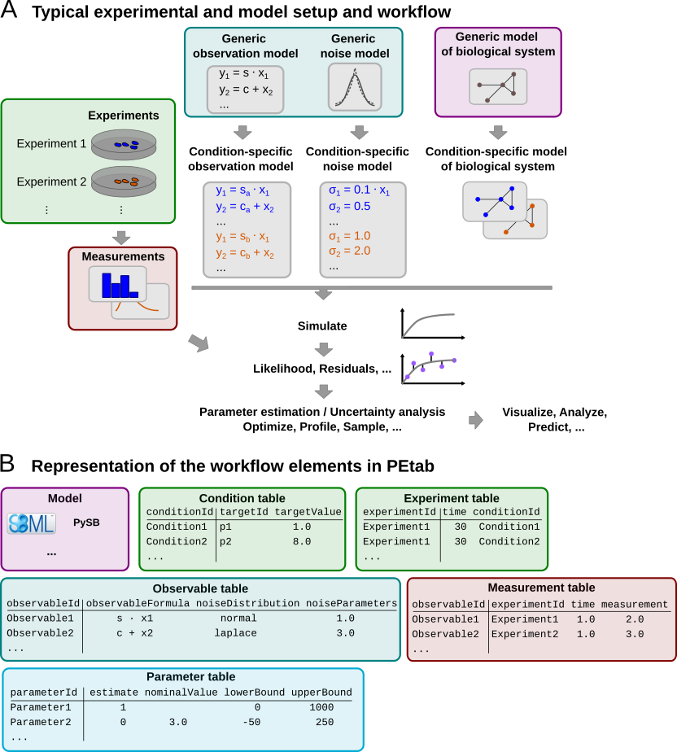

.. _v2_spec:

PEtab data format specification 2.0
===================================

.. warning::

    This document is a draft and subject to change.

Format version: 2.0.0

This document explains the PEtab data format.

Purpose
-------

PEtab provides a standardized framework for defining parameter estimation
problems in systems biology, particularly for Ordinary Differential Equation
(ODE) models.

Scope
-----

The scope of PEtab is the complete specification of parameter estimation
problems in typical systems biology applications. In practise, data-driven
modeling often begins with either (i) a computational model of a biological
system that requires calibration or (ii) experimental data that need
integration and analysis through a computational model.

Measurements are linked to the biological model by an observation and noise
model. Often, measurements are taken after some experimental perturbations
have been applied, which are represented as derivations from a generic model
(Figure 1A). Therefore, one goal was to specify such a setup in the least
redundant way. Furthermore, we wanted to establish an intuitive, modular,
machine- and human-readable and -writable format that makes use of existing
standards.

         representation in PEtab.
   :scale: 80%

   **Figure 1: A typical setup for data-based modeling studies and its
   representation in PEtab.**

Overview
---------

The PEtab data format defines a parameter estimation problem using multiple
text-based files in `YAML <https://yaml.org/>`_ and `Tab-Separated Values (TSV)
<https://www.iana.org/assignments/media-types/text/tab-separated-values>`_
format (Figure 2), including:

- A :ref:`grouping file <v2_problem_yaml>` that lists all of the following
  files and provides additional information including
  :ref:`extensions <petab_extensions>` [YAML].

- :ref:`Parameter file(s) <v2_parameter_table>` to set parameter values
  globally, and to specify the parameters to be estimated as well as their
  parameter bounds and prior distributions [TSV].

- :ref:`Model <v2_model>` file(s) specifying the base model(s)
  [SBML, CELLML, BNGL, PYSB, ...].

- :ref:`Observable file(s) <v2_observable_table>` defining the observation
  model [TSV].

- :ref:`Measurement file(s) <v2_measurement_table>` containing experimental
  data used for model fitting [TSV].

- (optional) :ref:`Condition file(s) <v2_condition_table>` specifying model
  inputs and condition-specific parameters [TSV].

- (optional) :ref:`Experiment file(s) <v2_experiment_table>` describing
  sequences of experimental conditions applied to the model [TSV].

- (optional) :ref:`Mapping file(s) <v2_mapping_table>` assigning
  PEtab-compatible IDs to model entities that do not have valid
  PEtab IDs themselves, and providing additional annotations [TSV].

   **Figure 2: Files constituting a PEtab problem.**

Figure 1B shows how those files relate to a typical data-based modeling setup.

The following sections outline the minimum requirements of those components
in the core standard, which should provide all necessary information for
defining a parameter estimation problem.

Extensions of this format (e.g., additional columns in the measurement table)
are allowed and encouraged. While such extensions can enhance plotting,
downstream analysis, or improve efficiency in parameter estimation, they
should not alter the definition of the estimation problem itself.

**General remarks**

- All model entities, column names and row names are case-sensitive.
- Fields enclosed in "[]" are optional and may be left empty.
- The following data types are used in descriptions below:

  - ``STRING``: Any string.
  - ``NUMERIC``: Any number excluding ``NaN`` / ``inf`` / ``-inf``
  - ``MATH_EXPRESSION``: A mathematical expression according to the
    `PEtab math expression syntax <math_expressions>`_.
  - ``PETAB_ID``: A string that is a valid PEtab ID.
  - ``NON_PARAMETER_TABLE_ID``: A valid PEtab ID referring to a constant or
    differential entity (:ref:`v2_model_entities`), including PEtab output
    parameters, but excluding parameters listed in the
    :ref:`v2_parameter_table` (independent of their ``estimate`` value).

.. _v2_changes:

Changes from PEtab 1.0.0
------------------------
PEtab 2.0.0 is a major update of the PEtab format. The main changes are:

* The :ref:`PEtab YAML problem description <v2_problem_yaml>` is now
  mandatory and its structure changed. In particular, the `problems` list
  has been flattened.
* Support for models in other formats than SBML (:ref:`v2_model`).
* The use of different models for different measurements is now
  supported via the optional ``modelId`` column in the
  :ref:`v2_measurement_table`, see also :ref:`v2_multiple_models`.
  This was poorly defined in PEtab 1.0.0 and probably not used in practice.
* The (now optional) condition table format changed from wide to long
  (:ref:`v2_condition_table`).
* ``simulationConditionId`` and ``preequilibrationConditionId`` in the
  :ref:`v2_measurement_table` are replaced by ``experimentId`` and a more
  flexible way for defining experiments and time courses. This allows
  arbitrary sequences of conditions and combinations of conditions to be
  applied to the model (Figure 3 and :ref:`v2_experiment_table`).

   **Figure 3: A comparison of simulations in PEtab v1 and v2.**

* Support for math expressions in the condition table
  (:ref:`v2_condition_table`, :ref:`v2_math_expressions`).
* Clarification and specification of various previously underspecified
  aspects, including overriding values via the condition table
  (:ref:`v2_initialization_semantics`, :ref:`v2_reinitialization_semantics`).
* Support for format :ref:`extensions <petab_extensions>`.
* Observable IDs can now be used in observable and noise formulas
  (:ref:`v2_observable_table`).
* The ``parameterScale`` column of the :ref:`v2_parameter_table` is removed.
  This change was made to simplify the PEtab format.
  This feature was a constant source of confusion and the interaction with
  parameter priors was not well-defined.
  To obtain the same effect, the model parameters can be transformed in the
  model file.
* The ``initializationPriorType`` and ``initializationPriorParameters``
  columns  of the :ref:`v2_parameter_table` are removed. Initialization
  priors are outside the definition of the parameter estimation problem
  and were a source of confusion.
* ``objectivePriorType`` and ``objectivePriorParameters`` in the
  :ref:`v2_parameter_table` are renamed to ``priorDistribution`` and
  ``priorParameters``, respectively. This change was made to simplify
  the PEtab format.
* The admissible values for ``estimate`` in the :ref:`v2_parameter_table`
  are now ``true`` and ``false`` instead of ``1`` and ``0``.
* Support for new parameter prior distributions in the
  :ref:`v2_parameter_table`, and clarification that bounds truncate the
  prior distributions.
* The ``observableTransformation`` column of the :ref:`v2_observable_table`
  has been combined with the ``noiseDistribution`` column to make its intent
  clearer. The ``log10`` transformation has been removed, since this was mostly
  relevant for visualization purposes, and the same effect can be achieved by
  rescaling the parameters of the respective (natural) log-distributions.
* The ``observableFormula`` field in the :ref:`v2_observable_table` must not
  contain any observable IDs. This was previously allowed, but it was not
  well-defined how to deal with placeholder parameters in this case.
  The ``noiseFormula`` field may contain only the observable ID of the
  respective observable itself, but no other observable IDs for the same
  reason.
* Placeholders for measurement-specific parameters in ``observableFormula``
  and ``noiseFormula`` are now declared using the
  ``observablePlaceholders`` and ``noisePlaceholders`` fields in the
  :ref:`v2_observable_table`. This replaces the previous
  ``observableParameter${n}_${observableId}`` syntax. The new approach is more
  explicit and allows for more descriptive and shorter names for the
  placeholders.
* The visualization table has been removed. The PEtab v1 visualization table
  was not well-defined and not widely used. Visualization is handled by the
  PEtab Python library which also provides documentation on the respective
  input format.

.. _v2_model:
.. _v2_model_entities:

Model definition
----------------

PEtab 2.0.0 is **model format agnostic**, meaning it does not depend on a
specific model description. The model file is referenced in the :ref:`PEtab
problem description (YAML) <v2_problem_yaml>` by its file name or a URL.

PEtab distinguishes between three types of entities:

* **Differential entities**: Entities that are defined in terms of a
  time-derivative, e.g., the targets of SBML rate rules or species that change
  due to participation in reactions (reactants or products).

* **Algebraic entities**: Entities that are defined in terms of algebraic
  assignments, rather than time derivatives, that are in effect throughout the
  simulation. They are not necessarily constant, for example,
  the targets of SBML assignment rules.

* **Constant entities**: Entities are that not differential or algebraic
  entities. They are defined in terms of an at least piecewise constant
  value but may be subject to event assignments, e.g., parameters of an SBML
  model that are not targets of rate rules or assignment rules.

.. _v2_condition_table:

Condition table
---------------

The optional condition table defines discrete changes to the simulated model(s).
These (sets of) changes typically represent interventions, perturbations, or
changes in the environment of the system of interest. These modifications are
referred to as (experimental) *conditions*.

Conditions are applied at specific time points, which are defined in the
:ref:`v2_experiment_table`. This allows for the specification of time
courses or experiments spanning multiple time periods. A time period is the
interval between two consecutive time points in the experiment table
(including the first, excluding the second) for a given experiment,
or the time between the last time point of an experiment and
the end of the simulation (usually, the time point of the last measurement
for that experiment in the :ref:`v2_measurement_table`).

The condition table only allows changes in the model state, not the model
structure. That means that only constant or differential entities (e.g.,
constant parameters or model states) can be modified. **Algebraic entities**
(e.g., the targets of SBML assignment rules) cannot be changed.

The condition table is provided as a tab-separated values (TSV) file with
the following structure:

+--------------+-------------------------+--------------------+
| conditionId  | targetId                | targetValue        |
+==============+=========================+====================+
| PETAB_ID     | NON_PARAMETER_TABLE_ID  | MATH_EXPRESSION    |
+--------------+-------------------------+--------------------+
| e.g.         |                         |                    |
+--------------+-------------------------+--------------------+
| conditionId1 | modelEntityId1          | 0.42               |
+--------------+-------------------------+--------------------+
| conditionId1 | modelEntityId2          | 0.42               |
+--------------+-------------------------+--------------------+
| conditionId2 | modelEntityId1          | modelEntityId1 + 3 |
+--------------+-------------------------+--------------------+
| conditionId2 | someSpecies             | 8                  |
+--------------+-------------------------+--------------------+
| ...          | ...                     | ...                |
+--------------+-------------------------+--------------------+

Each row in the condition table represents a single modification to a target
entity. The order of rows and columns is arbitrary, but placing
``conditionId`` first can enhance readability.

Detailed field description
~~~~~~~~~~~~~~~~~~~~~~~~~~

- ``conditionId`` [PETAB_ID, REQUIRED]

  A unique identifier for the condition associated with the change. This ID
  is referenced in the :ref:`v2_experiment_table`.

- ``targetId`` [NON_PARAMETER_TABLE_ID, REQUIRED]

  The ID of the entity being modified. The target must be either a constant
  or differential entity and must not be listed in the
  :ref:`v2_parameter_table`.

- ``targetValue`` [MATH_EXPRESSION, REQUIRED]

  The value or mathematical expression used to modify the target. When the
  corresponding condition is applied, the entity specified in ``targetId``
  is set to the value defined in ``targetValue`` (see below for details).

  If the model has a concept of species and a species ID is provided, its
  value is interpreted as either amount or concentration consistent with
  its usage elsewhere in the model.

.. _v2_reinitialization_semantics:

Detailed semantics
~~~~~~~~~~~~~~~~~~

See :ref:`v2_initialization_semantics` for how the changes for the initial
period of an experiment are applied and how the model is initialized.
For any subsequent time period, the changes defined in the condition table
are applied in five consecutive phases:

1. **Evaluation of** ``targetValues``

   ``targetValues`` are first evaluated using the *current* values of all
   variables in the respective expressions.
   The *current* values are taken from the simulation results at the end of the
   preceding time period.
   A special case is simulation time (``time``),
   which is set to the start time of the current time period.

2. **Assignment of the evaluated** ``targetValues`` **to their targets**

   All evaluated ``targetValues`` are simultaneously assigned to their
   respective targets. It is invalid to apply multiple assignments to the
   same target at the same time.

   The interpretation of the assigned value depends on the type of the
   model and the target entity.
   For example, for an SBML model and a ``targetId`` referring to a species,
   the ``targetValue`` will override the current amount of the species
   if ``hasOnlySubstanceUnits=true`` (*amount-based species*),
   or the current concentration if ``hasOnlySubstanceUnits=false``
   (*concentration-based species*).

   If the target is a compartment, the compartment size is set to the
   evaluated value of the ``targetValue`` expression.
   The value of a species in such a compartment is not changed by this
   assignment. I.e., for an amount-based species, the amount of the species
   will be preserved (the concentration may change accordingly),
   and for a concentration-based species, the concentration will be preserved
   (the amount may change accordingly).
   Mind that this differs from the behavior of an SBML event assignment where
   compartment size changes always preserve the amounts of species in that
   compartment.

3. **Update of derived variables**

   After target values have been assigned, all derived variables (i.e.,
   algebraic entities such as SBML assignment rules or PySB expressions)
   are updated.

4. **Events and finalization**

   At this stage, all remaining state- or time-dependent changes encoded in
   the model are applied, including SBML events. The model state used for the
   evaluation of trigger functions or the execution of any event assignments
   (including events with delays) is the model state after (3).

   The initial model state for the new period at `time` = ``time``
   (:ref:`v2_experiment_table`) is the model state after all these updates
   have been applied.

5. **Evaluation of observables**

   If measurements exist for the current timepoint, the observables are
   evaluated after all changes have been applied. The resulting values are
   then compared against the corresponding measurements in the measurement table.

.. _v2_experiment_table:

Experiment table
----------------

The optional experiments table defines a sequence (Figure 3, lower) of
experimental conditions (i.e., discrete changes; see
:ref:`v2_condition_table`) applied to the model.

The experiment table is provided as a tab-separated values (TSV) file with
the following structure:

+---------------------+-------------------+-----------------+
| experimentId        | time              | conditionId     |
+=====================+===================+=================+
| PETAB_ID            | NUMERIC or '-inf' | CONDITION_ID    |
+---------------------+-------------------+-----------------+
| e.g.                |                   |                 |
+---------------------+-------------------+-----------------+
| timecourse_1        |                 0 | condition_1     |
+---------------------+-------------------+-----------------+
| timecourse_1        |                10 | condition_2     |
+---------------------+-------------------+-----------------+
| timecourse_1        |               250 | condition_3     |
+---------------------+-------------------+-----------------+
| patient_3           |              -inf | condition_1     |
+---------------------+-------------------+-----------------+
| patient_3           |                 0 | condition_2     |
+---------------------+-------------------+-----------------+
| intervention_effect |               -20 | no_lockdown     |
+---------------------+-------------------+-----------------+
| intervention_effect |                20 | mild_lockdown   |
+---------------------+-------------------+-----------------+
| intervention_effect |                40 | severe_lockdown |
+---------------------+-------------------+-----------------+

The order of the rows is arbitrary, but specifying the rows in ascending order
of time may improve human readability.

Detailed field description
~~~~~~~~~~~~~~~~~~~~~~~~~~

The experiment table has three mandatory columns ``experimentId``,
``time``, and ``conditionId``:

- ``experimentId`` [PETAB_ID, REQUIRED]

  A unique identifier for the experiment, referenced by the ``experimentId``
  column in the :ref:`v2_measurement_table`.

- ``time``: [NUMERIC or ``-inf``, REQUIRED]

  The time at which the specified condition will become active, in the time
  unit specified in the model. ``-inf`` indicates that the respective
  condition will be simulated until a steady state is reached.

  .. note::

     In PEtab, the steady state definition is that *all* differential entities
     are at steady state, meaning that all differential entities have reached,
     and will remain at, a constant value.

     Determining whether differential entities are at steady state is left to
     the simulator and user. Reasonable numerical criteria should be used
     to determine whether a steady state is reached. Users should
     share their chosen numerical criteria when sharing their model, for
     reproducibility.

     It can be difficult to determine whether the differential entities are
     at steady state. For example, events and other discontinuities may
     occur after an apparent steady state is reached. It is left to the user to
     avoid situations where this issue is problematic.

  If the simulation of a condition with steady state fails to reach a steady state,
  and the condition is required for the evaluation of simulation at
  measurement points, the evaluation of the model is not well-defined.
  In such cases, PEtab interpreters should notify the user, for example, by
  returning ``NaN`` or ``inf`` values for the objective function.
  PEtab does not specify a numerical criterion for steady states.
  Any event triggers defined in the model must also be checked during this
  pre-simulation.

  Multiple conditions may be applied simultaneously by specifying the same
  ``experimentId`` and ``time`` for multiple conditions. The changes associated
  with these conditions must be disjoint, i.e., no two conditions applied at
  the same time may involve the same ``targetId``. The union of these changes is
  applied to the model as if they were specified as a single condition.

  ``time`` will override any initial time specified in the model,
  except in the case of ``time`` =  ``-ìnf``, in which case the model-specified
  time will be used (or 0, if the model does not explicitly specify an initial
  time).

- ``conditionId``:
  [PETAB_ID or empty, REQUIRED, REFERENCES(condition.conditionId)]

  A reference to a condition ID in the :ref:`v2_condition_table` that
  will be applied at the given ``time``. If empty, no changes are applied.

  For further details, see :ref:`v2_reinitialization_semantics`.

.. _v2_measurement_table:

Measurement table
-----------------

A tab-separated values files containing all measurements to be used for
model training or validation.

Expected to have the following named columns in any (but preferably this)
order:

+--------------+--------------+-------------+--------------+
| observableId | experimentId | measurement | time         |
+==============+==============+=============+==============+
| PETAB_ID     | PETAB_ID     | NUMERIC     | NUMERIC\|inf |
+--------------+--------------+-------------+--------------+
| e.g.         |              |             |              |
+--------------+--------------+-------------+--------------+
| observable1  | experiment1  | 0.42        | 0            |
+--------------+--------------+-------------+--------------+
| ...          | ...          | ...         | ...          |
+--------------+--------------+-------------+--------------+

*(wrapped for readability)*

+-----+----------------------------------------------------+----------------------------------------------------+
| ... | [observableParameters]                             | [noiseParameters]                                  |
+=====+====================================================+====================================================+
| ... | [parameterId\|NUMERIC[;parameterId\|NUMERIC][...]] | [parameterId\|NUMERIC[;parameterId\|NUMERIC][...]] |
+-----+----------------------------------------------------+----------------------------------------------------+
| ... |                                                    |                                                    |
+-----+----------------------------------------------------+----------------------------------------------------+
| ... |                                                    |                                                    |
+-----+----------------------------------------------------+----------------------------------------------------+
| ... | ...                                                | ...                                                |
+-----+----------------------------------------------------+----------------------------------------------------+

Additional (non-standard) columns may be added.

Detailed field description
~~~~~~~~~~~~~~~~~~~~~~~~~~

- ``observableId``
  [PETAB_ID, REQUIRED, REFERENCES(observable.observableId)]

  Observable ID as defined in the observable table described below.

- ``experimentId``
  [PETAB_ID or empty, REQUIRED, REFERENCES(experiment.experimentId)]

  Experiment ID as defined in the experiment table described below. This
  column may have empty cells, which are interpreted as *use the model as is*.
  This avoids the need for "dummy" conditions and experiments if only a single
  condition is required. If no experiment is specified, the model simulation
  is assumed to start at time 0, unless the model specifies a different
  initial time.

- ``measurement`` [NUMERIC, REQUIRED]

  The measured value in the same units/scale as the model output.

- ``time`` [NUMERIC OR ``inf``, REQUIRED]

  Time point of the measurement in the time unit specified in the employed model,
  a finite numeric value, or ``inf`` (lower-case) for steady-state
  measurements (the same definition of steady state as in the
  :ref:`v2_experiment_table` applies here, with the additional
  sanity check that the steady state occurs during the final
  experiment period).
  This value must be greater than or equal to the first time point
  of the experiment referenced in the ``experimentId`` column
  that is not ``-inf``.

  If this time point coincides with the time point of a condition change,
  the condition change is applied before the observable is evaluated
  (see :ref:`v2_reinitialization_semantics` for details).

- ``observableParameters`` [NUMERIC, STRING OR NULL, OPTIONAL]

  Measurement-specific overrides for placeholder parameters in the
  `observableFormula` declared in the
  :ref:`observable table <v2_observable_table>`.

  The :ref:`observable table <v2_observable_table>` allows marking some
  parameters as measurement-specific (see `observablePlaceholders` there).
  Their values for a given measurement are specified in this column.
  The values are separated by semicolons.
  The order and number of values must match the order and number of
  placeholders in the ``observablePlaceholders`` field of the corresponding
  observable in the observable table. I.e., if the observable table contains
  no observable placeholders for the given observable, this field must be
  empty.
  The values may be either numeric values or the IDs of parameters from the
  :ref:`parameter table <v2_parameter_table>`.

  Different lines for the same ``observableId`` may specify different
  values. This may be used to account for condition-specific or
  batch-specific parameters.

  If none of the observables use any observable placeholders,
  this column may be omitted.

- ``noiseParameters`` [NUMERIC, STRING OR NULL, OPTIONAL]

  Measurement-specific overrides for placeholder parameters in the
  `noiseFormula` declared in the
  :ref:`observable table <v2_observable_table>`.

  The :ref:`observable table <v2_observable_table>` allows marking some
  parameters as measurement-specific (see `noisePlaceholders` there).
  Their values for a given measurement are specified in this column.
  The values are separated by semicolons.
  The order and number of values must match the order and number of
  placeholders in the ``noisePlaceholders`` field of the corresponding
  observable in the observable table. I.e., if the observable table contains
  no noise placeholders for the given observable, this field must be
  empty.
  The values may be either numeric values or the IDs of parameters from the
  :ref:`parameter table <v2_parameter_table>`.

  Different lines for the same ``observableId`` may specify different
  values. This may be used to account for condition-specific or
  batch-specific parameters.

  If none of the observables use any noise placeholders,
  this column may be omitted.

- ``modelId`` [PETAB_ID, OPTIONAL, REFERENCES(yaml.models.model_id)]

  Which model to simulate for each data point. Model IDs are defined by the
  keys of the `models` object in the PEtab problem YAML file.
  This column is required when multiple models are defined in the PEtab
  problem (see :ref:`v2_multiple_models`).
  For problems with a single model, this column is optional,
  and its values default to the ID of the only model present.

.. _v2_simulation_table:

Simulation table
~~~~~~~~~~~~~~~~

For some applications, it is useful to provide a simulation file that contains
the simulation results of the model for the same time points as the
measurements. This is useful, for example, for comparing the simulation results
with the measurements, or for assessing simulation reproducibility across tools.
The simulation table is provided as a tab-separated values (TSV) file with
the same structure as the measurement table, only that the
``measurement`` column is replaced by the ``simulation`` column that contains
the simulation results.

.. _v2_observable_table:

Observable table
----------------

Parameter estimation requires linking experimental observations to the model
of interest. Therefore, one needs to define observables (model outputs) and
respective noise models, which represent the measurement process.
Since parameter estimation is beyond the scope of SBML, there exists no
standard way to specify observables (model outputs) and respective noise
models. Therefore, in PEtab observables are specified in a separate table
as described in the following. This allows for a clear separation of the
observation model and the underlying dynamic model, which allows, in most
cases, to reuse any existing SBML model without modifications.

The observable table has the following columns:

+-----------------------+--------------------------------+-----------------------------------------------------------------------------+
| observableId          | [observableName]               | observableFormula                                                           |
+=======================+================================+=============================================================================+
| STRING                | [STRING]                       | STRING                                                                      |
+-----------------------+--------------------------------+-----------------------------------------------------------------------------+
| e.g.                  |                                |                                                                             |
+-----------------------+--------------------------------+-----------------------------------------------------------------------------+
| relativeTotalProtein1 | Relative abundance of Protein1 | observableParameter1_relativeTotalProtein1 * (protein1 + phospho_protein1 ) |
+-----------------------+--------------------------------+-----------------------------------------------------------------------------+
| ...                   | ...                            | ...                                                                         |
+-----------------------+--------------------------------+-----------------------------------------------------------------------------+

*(wrapped for readability)*

+-----+---------------------------------------+-----------------------+
| ... | noiseFormula                          | [noiseDistribution]   |
+=====+=======================================+=======================+
| ... | STRING\|NUMBER                        | *see below*           |
+-----+---------------------------------------+-----------------------+
| ... |                                       |                       |
+-----+---------------------------------------+-----------------------+
| ... | noiseParameter1_relativeTotalProtein1 | normal                |
+-----+---------------------------------------+-----------------------+
| ... | ...                                   | ...                   |
+-----+---------------------------------------+-----------------------+

Detailed field description
~~~~~~~~~~~~~~~~~~~~~~~~~~

* ``observableId`` [STRING]

  Unique identifier for the given observable. Must consist only of upper and
  lower case letters, digits and underscores, and must not start with a digit.
  This is referenced by the ``observableId`` column in the measurement table.

* [``observableName``] [STRING, OPTIONAL]

  Name of the observable. Only used for output, not for identification.

* ``observableFormula`` [STRING]

  Observation function as plain text formula expression.
  The expression may contain any symbol defined in a model,
  the mapping table or the parameter table.
  Often, this is just the ID of a state variable.
  Furthermore, any parameters introduced through the ``observablePlaceholders``
  field for the given observable may be used (see below).

* ``observablePlaceholders`` [LIST[PETAB_ID], OPTIONAL]

  A semicolon-separated list of valid PEtab identifiers that have not been
  introduced elsewhere, marking them as placeholders for
  measurement-specific parameters.
  The actual values for these parameters are specified in the
  ``observableParameters`` field of the measurement table.
  The ordering and number of values in ``observableParameters`` must match the
  ordering and number of placeholders in ``observablePlaceholders``.
  For an example, see the description of ``noisePlaceholders`` below.

* ``noiseFormula`` [NUMERIC|STRING]

  The scale parameter of the noise distribution for the given observable.

  Measurement noise can be specified as a numerical value which will
  default to a Gaussian noise model if not specified differently in
  ``noiseDistribution`` with standard deviation as provided here. In this case,
  the same standard deviation is assumed for all measurements for the given
  observable.

  Alternatively, some formula expression can be provided to specify
  more complex noise models. The same rules as for ``observableFormula``
  apply here. In addition, the current observable ID may be used to refer to
  the ``observableFormula`` expression.
  In addition to the placeholders declared in ``observablePlaceholders``,
  placeholders for noise parameters that are declared in ``noisePlaceholders``
  may be used.

* ``noisePlaceholders`` [LIST[PETAB_ID], OPTIONAL]

  A semicolon-delimited list of valid PEtab identifiers that have not been
  introduced elsewhere, marking them as placeholders for
  measurement-specific noise parameters.
  The actual values for these parameters are specified in the
  ``noiseParameters`` field of the measurement table.
  The ordering and number of values in ``noiseParameters`` must match the
  ordering and number of placeholders in ``noisePlaceholders``.

  For example, a noise model that accounts for measurement-specific relative
  and absolute contributions for some observable with the ID
  ``observable_pErk`` could be defined as::

    noise_offset_pErk + noise_scale_pErk * observable_pErk

  with ``noise_offset_pErk`` denoting the absolute and
  ``noise_scale_pErk`` the relative contribution.
  The corresponding ``noisePlaceholders`` would be::

    noise_offset_pErk;noise_scale_pErk

  and the ``noiseParameters`` in the measurement table could be, for example,
  ``0.1;0.2`` resulting in::

    noise_offset_pErk = 0.1
    noise_scale_pErk = 0.2

* ``noiseDistribution`` [STRING, OPTIONAL]

  Assumed noise distribution for the measurements of the given observable.
  The supported :ref:`noise distributions <v2_noise_distributions>` and the
  respective interpretation of ``noiseFormula`` are given in the table below.

.. _v2_noise_distributions:

Noise distributions
~~~~~~~~~~~~~~~~~~~

Denote by :math:`m` the measured value,
:math:`y:=\text{observableFormula}` the simulated value
(the location parameter of the noise distribution),
and :math:`\sigma` the scale parameter of the noise distribution
as given via the ``noiseFormula`` field (the standard deviation of a normal,
or the scale parameter of a Laplace model).
Then we have the following effective noise distributions:

.. list-table::
  :header-rows: 1
  :widths: 10 10 80

  * - Type
    - ``noiseDistribution``
    - Probability density function (PDF)
  * - Gaussian distribution
    - ``normal``
    - .. math::
         \pi(m|y,\sigma) = \frac{1}{\sqrt{2\pi}\sigma}\exp\left(-\frac{(m-y)^2}{2\sigma^2}\right)
  * - | Log-normal distribution
      | (i.e., :math:`\log(m)` is normally distributed)
    - ``log-normal``
    - .. math::
         \pi(m|y,\sigma) = \frac{1}{\sqrt{2\pi}\sigma m}\exp\left(-\frac{(\log m - \log y)^2}{2\sigma^2}\right)
  * - Laplace distribution
    - ``laplace``
    - .. math::
         \pi(m|y,\sigma) = \frac{1}{2\sigma}\exp\left(-\frac{|m-y|}{\sigma}\right)
  * - | Log-Laplace distribution
      | (i.e., :math:`\log(m)` is Laplace distributed)
    - ``log-laplace``
    - .. math::
         \pi(m|y,\sigma) = \frac{1}{2\sigma m}\exp\left(-\frac{|\log m - \log y|}{\sigma}\right)

The distributions above are for a single data point.
For a collection :math:`D=\{m_i\}_i` of data points and corresponding
simulations :math:`Y=\{y_i\}_i`
and noise parameters :math:`\Sigma=\{\sigma_i\}_i`,
the current specification assumes independence, i.e. the full distribution is

.. math::
   \pi(D|Y,\Sigma) = \prod_i\pi(m_i|y_i,\sigma_i)

.. _v2_parameter_table:

Parameter table
---------------

A tab-separated value text file containing information on model parameters.

This table *must* include the following parameters:

- Named parameter overrides introduced in ``targetValue`` expressions
  in the *condition table*, unless already defined in the model
- Named parameter overrides introduced in ``observableParameters``
  or ``noiseParameters`` in the *measurement table*
- Parameters introduced in the ``observableFormula`` or ``noiseFormula``
  expressions in the *observable table*

and *must not* include:

- Placeholder parameters (see ``observableParameters`` and ``noiseParameters``
  above)
- Parameters occurring as ``targetId`` in the *condition table*
- "Parameters" that are not *constant* entities (e.g., in an SBML model,
  the targets of *AssignmentRules* or *EventAssignments*)
- Any parameters that do not have valid PEtab IDs
  (e.g., SBML *local* parameters that are not mapped in the mapping table)

it *may* include:

- Any model parameter that was not excluded above

One row per parameter with arbitrary order of rows and columns:

+-------------+-----------------+-------------+------------+--------------+-------------+-----+
| parameterId | [parameterName] | lowerBound  | upperBound | nominalValue | estimate    | ... |
+=============+=================+=============+============+==============+=============+=====+
| PETAB_ID    | [STRING]        | NUMERIC     | NUMERIC    | NUMERIC      | true\|false | ... |
+-------------+-----------------+-------------+------------+--------------+-------------+-----+
| k1          |                 | 1e-5        | 1e5        | 100          | true        | ... |
+-------------+-----------------+-------------+------------+--------------+-------------+-----+
| ...         | ...             | ...         | ...        | ...          | ...         | ... |
+-------------+-----------------+-------------+------------+--------------+-------------+-----+

*(wrapped for readability)*

+-----+-------------------------+----------------------------+
| ... | [priorDistribution]     | [priorParameters]          |
+=====+=========================+============================+
| ... | *see below*             | *see below*                |
+-----+-------------------------+----------------------------+
| ... | normal                  | 1000;100                   |
+-----+-------------------------+----------------------------+
| ... | ...                     | ...                        |
+-----+-------------------------+----------------------------+

Additional columns may be added.

See :ref:`v2_initialization_semantics` for details on how and when the values
of parameter table parameters are applied.

Detailed field description
~~~~~~~~~~~~~~~~~~~~~~~~~~

- ``parameterId`` [PETAB_ID, REQUIRED]

  The ``parameterId`` of the parameter described in this row. This has to match
  the ID of a parameter specified in at least one model, a parameter introduced
  as override in the condition table, or a parameter occurring in the
  ``observableParameters`` or ``noiseParameters`` column of the measurement table
  (see above).

- ``parameterName`` [STRING, OPTIONAL]

  Parameter name to be used e.g. for plotting etc. Can be chosen freely. May
  or may not coincide with the SBML parameter name.

- ``lowerBound`` [NUMERIC]

  Lower bound of the parameter used for estimation.
  Optional, if ``estimate==false``.

- ``upperBound`` [NUMERIC]

  Upper bound of the parameter used for estimation.
  Optional, if ``estimate==false``.

- ``nominalValue`` [NUMERIC]

  Some parameter value to be used if
  the parameter is not subject to estimation (see ``estimate`` below).
  Optional, unless ``estimate==false``.

- ``estimate`` [``true`` | ``false``]

  ``true`` or ``false`` (case-sensitive), depending on, if the parameter is
  estimated (``true``) or set to a fixed value (``false``)
  (see ``nominalValue``).

- ``priorDistribution`` [STRING, OPTIONAL]

  Prior types used for the
  :ref:`MAP objective function and for Bayesian inference <v2_objective_function>`.
  It is valid to have no priors. However, if priors are specified for a subset
  of parameters, this defaults to the ``uniform`` prior (with ``priorParameters``
  set to ``lowerBound;upperBound``) for the other parameters.

  Prior distributions are
  `truncated <https://en.wikipedia.org/wiki/Truncated_distribution>`__
  by the ``lowerBound`` and ``upperBound`` if
  the prior's domain exceeds the parameter bounds. A non-truncated prior can
  be created by setting the parameter bounds to  match the prior's domain
  (e.g., ``0`` and ``inf`` for ``log-normal``). For supported prior distributions
  see :ref:`prior distributions <v2_prior_distributions>`.

- ``priorParameters`` [STRING, OPTIONAL]

  Prior parameters used for the
  :ref:`MAP objective function and for Bayesian inference <v2_objective_function>`.
  ``priorParameters`` is required if ``priorDistribution`` is non-empty.

  Only numeric values are supported (no parameter IDs). For available
  parameters see :ref:`prior distributions <v2_prior_distributions>`.

.. _v2_prior_distributions:

Prior distributions
~~~~~~~~~~~~~~~~~~~

Let :math:`x` denote the parameter value and :math:`\Gamma` the
`Gamma function <https://en.wikipedia.org/wiki/Gamma_function>`__.,
then the following prior distributions are supported:

.. list-table::
  :header-rows: 1
  :widths: 10 15 20 5

  * - ``priorDistribution``
    - ``priorParameters``
    - Probability density function (PDF)
    - Domain
  * - ``cauchy``
    - location (:math:`\mu`); scale (:math:`\sigma`)
    - .. math::
        \pi(x|\mu, \sigma) = \frac{1}{\pi \sigma \left( 1 + \left(\frac{x - \mu}{\sigma} \right)^2\right)}
    - :math:`(-\infty, \infty)`

  * - ``chisquare``
    - degrees of freedom (:math:`\nu`)
    - .. math::
        \pi(x|\nu) = \frac{x^{\nu/2-1}e^{-x/2}}{2^{\nu/2}\Gamma(\nu/2)}
    - :math:`(0, \infty)`

  * - ``exponential``
    - scale (:math:`\theta`)
    - .. math::
        \pi(x|\theta) = \frac{1}{\theta}e^{-x/\theta}
    - :math:`(0, \infty)`

  * - ``gamma``
    - shape (:math:`\alpha`); scale (:math:`\theta`)
    - .. math::
        \pi(x|\alpha, \theta) = \frac{x^{\alpha - 1}e^{-x/\theta}}{\Gamma(\alpha)\theta^{\alpha}}
    - :math:`(-\infty, \infty)`

  * - ``laplace``
    - location (:math:`\mu`); scale (:math:`\sigma`)
    - .. math::
        \pi(x|\mu, \sigma) = \frac{1}{2\sigma}\exp\left(- \frac{|x - \mu |}{\sigma}\right)
    - :math:`(-\infty, \infty)`

  * - ``log-laplace``
    - location (:math:`\mu`); scale (:math:`\sigma`)
    - .. math::
        \pi(x|\mu, \sigma) = \frac{1}{2\sigma x} \exp\left( - \frac{|\log(x) - \mu|}{\sigma} \right)
    - :math:`(0, \infty)`

  * - ``log-normal``
    - mean (:math:`\mu`); standard deviation (:math:`\sigma`)
    - .. math::
        \pi(x|\mu, \sigma) = \frac{1}{x \sqrt{2\pi}\sigma} \exp\left(- \frac{\left(\log(x) - \mu\right)^2}{2\sigma^2}\right)
    - :math:`(0, \infty)`

  * - ``log-uniform``
    - lower bound (:math:`a`); upper bound (:math:`b`)
    - .. math::
        \pi(x|a, b) = \frac{1}{x\left( \log(b) - \log(a) \right)}
    - :math:`[a, b]`

  * - ``normal``
    - mean (:math:`\mu`); standard deviation (:math:`\sigma`)
    - .. math::
        \pi(x|\mu,\sigma) = \frac{1}{\sqrt{2\pi}\sigma}\exp\left(-\frac{(x-\mu)^2}{2\sigma^2}\right)
    - :math:`(-\infty, \infty)`

  * - ``rayleigh``
    - scale (:math:`\sigma`)
    - .. math::
        \pi(x|\sigma) = \frac{x}{\sigma^2}\exp\left(\frac{-x^2}{2\sigma^2}\right)
    - :math:`(0, \infty)`

  * - ``uniform``
    - lower bound (:math:`a`); upper bound (:math:`b`)
    - .. math::
        \pi(x|a, b) = \frac{1}{b - a}
    - :math:`[a, b]`

.. _v2_mapping_table:

Mapping table
-------------

The mapping table maps PEtab entity IDs to model entity IDs, and may be used
for additional annotations of model or PEtab entities. This file is optional.

This file may be used to provide PEtab-compatible aliases to model entities
whose ID in the model would not be a valid identifier in PEtab
(e.g., due to inclusion of blanks, dots, or other special characters),
and thus, would not be allowed in the PEtab problem files.

The TSV file has two mandatory columns, ``petabEntityId`` and
``modelEntityId``. Additional columns are allowed.

+---------------+---------------+---------------+
| petabEntityId | modelEntityId | [name]        |
+===============+===============+===============+
| PETAB_ID      | STRING        | STRING        |
+---------------+---------------+---------------+
| reaction1_k1  | reaction1.k1  | reaction1 k1  |
+---------------+---------------+---------------+

Detailed field description
~~~~~~~~~~~~~~~~~~~~~~~~~~

- ``petabEntityId`` [PETAB_ID, REQUIRED]

  A valid PEtab identifier (see :ref:`v2_identifiers`) that is not defined in
  any other part of the PEtab problem.
  This identifier may be referenced in condition, measurement, parameter and
  observable tables, but cannot be referenced in the model itself.

  The ``petabEntityId`` may be the same as the ``modelEntityId``, but it must
  not be used to alias an entity that already has a valid PEtab identifier.
  This restriction is to avoid unnecessary complexity in the PEtab problem
  files.

- ``modelEntityId`` [STRING or empty, REQUIRED]

  A globally unique identifier defined in any model, or empty if the entity is
  not present in any model. This does not have to be a valid PEtab identifier.
  Rows with empty ``modelEntityId`` serve as annotations only.

  For example, in SBML, local parameters may be referenced as
  ``$reactionId.$localParameterId``, which are not valid PEtab IDs as they
  contain a ``.`` character. Similarly, this table may be used to reference
  specific species in a BNGL model that may contain many unsupported
  characters such as ``,``, ``(`` or ``.``. However, please note that IDs must
  exactly match the species names in the BNGL-generated network file, and no
  pattern matching will be performed.

- ``name`` [STRING or empty, OPTIONAL]

  A human-readable name for the entity. This is optional and may be used for
  reporting or visualization purposes.
  Any tool making use of this value should default to the ``petabEntityId``
  if this field is empty.

.. _v2_problem_yaml:

YAML file for grouping files
----------------------------

To link the model, measurement table, condition table, etc. in an
unambiguous way, we use a `YAML <https://yaml.org/>`_ file.

This file also allows specifying a PEtab version and employed PEtab extensions.

Furthermore, this can be used to describe parameter estimation problems
comprising multiple models (more details below).

The format is described in the
`jsonschema <../_static/petab_schema_v2.yaml>`_, which allows for
easy validation:

.. literalinclude:: _static/petab_schema_v2.yaml
   :language: yaml

.. _v2_multiple_models:

Parameter estimation problems combining multiple models
~~~~~~~~~~~~~~~~~~~~~~~~~~~~~~~~~~~~~~~~~~~~~~~~~~~~~~~

Purpose
+++++++

PEtab supports defining multiple models within a single problem specification. This
feature is designed to enable users to define experiment-specific model variants or
submodels. Rather than implementing a single global, parameterized model, users can
define multiple smaller, self-contained models that differ structurally as needed.

This approach offers several benefits:

- Simplified model definition for users, as each variant can be independently
  specified.
- Improved simulation performance for tool developers, as smaller models can be
  simulated more efficiently.

Scope and Application
+++++++++++++++++++++

While multiple models are intended to be applied to different experiments, model
selection is specified at the level of individual data points in the
:ref:`v2_measurement_table`. This design enables:

- Reuse of experiments across models.
- Fine-grained model-to-data assignment.

With the exception of the :ref:`v2_measurement_table`, all other PEtab tables apply
to all models. Parameters listed in the parameter table are defined globally and
shared across all models. In contrast, entries in all other tables implicitly define
model-specific instances of observables, conditions, experiments, etc., with their
respective PEtab IDs existing in local, model-specific namespaces. Each PEtab
subproblem defined in this way must constitute a valid PEtab problem on its own.

This design has several implications:

- A single experiment may need to be simulated with different models for
  different measurements. However, a single simulation of a given experiment
  is always performed using one single model.
- Each model may be associated with a distinct subset of experiments.
- The number of conditions to be simulated for a model-specific instance
  of an experiment may vary across models.
- Each parameter defined in the :ref:`v2_parameter_table` has a shared value
  across all models. Parameters not listed in the parameter table do not share
  values, which can result in model-specific instantiations of model observables
  referencing these parameters.

Validation Rules
++++++++++++++++

For any given model, only those experiments and observables that appear in the
same rows of the :ref:`v2_measurement_table` need to be valid. This means that all
symbols used in the corresponding ``observableFormula`` and all symbols assigned
in the associated condition definitions must be defined in the model.

Conditions and observables that are not applied to a model do not need to be
valid for that model.

.. _v2_initialization_semantics:

Initialization and parameter application
----------------------------------------

The following describes how the model is initialized and how other PEtab
parameter values are applied before the simulation starts.
This procedure is executed for each model and experiment combination
defined in the PEtab problem.

1. Pre-initialization

   1. Parameters values for parameters that occur in the parameter table are
      applied to the uninitialized model.
      *Uninitialized* means that no model-internal initial values have been
      computed yet (e.g., in SBML models, no initial assignments have been
      evaluated and no derived initial quantities such as concentrations have
      been computed yet).
      For estimated parameters, the respective externally-provided values
      are applied and for non-estimated parameters, the nominal values
      from the parameter table are applied.

   2. The time is set to the start time of the first period of the given
      experiment (or 0 if there is no explicit experiment), and any
      experiment-specific conditions provided for the first period are applied
      (see :ref:`v2_reinitialization_semantics` for details).
      Target value expressions for the first period must not refer to model
      entities that are not also listed in the parameter table.

   This pre-initialization replaces any model-internal initial values
   (or initialization constructs such as SBML's *initialAssignments*)
   that would alter the initial time, the values of the parameters contained
   in the parameter table or any target values from the condition table.

2. Model initialization

   The model is initialized according to the model semantics, e.g., by
   evaluating the initial assignments or applying the initial values of
   state variables.

3. Simulation

   Model simulation starts with evaluating any event triggers at the initial
   time, applying pending event assignments, and evaluating the observables
   at the initial time (Steps 4 and 5 in :ref:`v2_reinitialization_semantics`).

   For any subsequent experiment periods, the steps described in
   :ref:`v2_reinitialization_semantics` are applied at their start times.

.. _v2_objective_function:

Frequentist vs. Bayesian inference
----------------------------------

PEtab supports `maximum likelihood estimation <https://en.wikipedia.org/wiki/Maximum_likelihood_estimation>`__,
`maximum a posteriori (MAP) estimation <https://en.wikipedia.org/wiki/Maximum_a_posteriori_estimation>`__,
and `Bayesian inference <https://en.wikipedia.org/wiki/Bayesian_inference>`__.

For MAP estimation and Bayesian inference, the prior
distributions :math:`p(\theta)` of the model parameters :math:`\theta` are
specified in the parameter table
(``priorDistribution`` and ``priorParameters`` columns,
as described above),
while for maximum likelihood estimation, the prior distributions are not
specified. If priors are only specified
for a subset of inferred parameters, the remaining parameters are assumed to have a
uniform prior between their lower and upper bounds.

For maximum likelihood estimation, the objective function is the negative
log-likelihood of the data given the model :math:`\mathcal{M}` with
parameters :

.. math::

    \mathcal{L}_{\text{ML}}(\theta) = - \log p(\mathcal{D} \mid \mathcal{M}, \theta)

    \theta_{\text{ML}} = \arg\min_{\theta} \mathcal{L}_{\text{ML}}(\theta)

Where :math:`p(\mathcal{D} \mid \mathcal{M}, \theta)` is the likelihood
as described under :ref:`v2_noise_distributions`.

For MAP estimation, the objective function is the unnormalized negative
log-posterior of the data given the model and the parameters:

.. math::

    \mathcal{L}_{\text{MAP}}(\theta) = - \log p(\mathcal{D} \mid \mathcal{M}, \theta) - \log p(\theta)

    \theta_{\text{MAP}} = \arg\min_{\theta} \mathcal{L}_{\text{MAP}}(\theta)

Different tools *may* use different objective function formulations internally,
as long as they preserve the optima. However, tools *should* provide the
final objective function value, as the negative log-likelihood or unnormalized
negative log-posterior, to facilitate comparison and reproducibility.

Example
~~~~~~~

In the case of independently and normally distributed noise, the negative
log-likelihood would be:

.. math::

    \mathcal{L}_{\text{ML}}(\theta) = \frac{1}{2} \sum_{i=1}^N \left( \log(2\pi \sigma_i^2) + \frac{(m_i - y_i)^2}{\sigma_i^2} \right)

where :math:`m_i` is the measurement, :math:`y_i` is the model output, and
:math:`\sigma_i` is the standard deviation of the noise for the :math:`i`-th
measurement.

.. _v2_math_expressions:

Math expressions syntax
-----------------------

This section describes the syntax of math expressions used in PEtab files, such
as the observable formulas.

Supported symbols, literals, and operations are described in the following. Whitespace is ignored in math expressions.

Symbols
~~~~~~~

* The supported identifiers are:

  * parameter IDs from the parameter table
  * model entity IDs that are globally unique and have a clear interpretation
    in a math expression context
  * observable IDs from the observable table
  * PEtab placeholder IDs in the observable and noise formulas
  * PEtab entity IDs in the mapping table
  * ``time`` for the model time
  * PEtab function names listed below

 Identifiers are not supported if they do not match the PEtab identifier
 format. PEtab expressions may have further context-specific restrictions on
 supported identifiers.

* The functions defined in PEtab are tabulated below. Other functions,
  including those defined in the model, remain undefined in PEtab expressions.

* Special symbols (such as :math:`e` and :math:`\pi`) are not supported, and
  neither is NaN (not-a-number).

Model time
++++++++++

The model time is represented by the symbol ``time``, which is the current
simulated time, not the current duration of simulated time; if the simulation
starts at :math:`t_0 \neq 0`, then ``time`` is *not* the time since
:math:`t_0`.

Literals
~~~~~~~~

Numbers
+++++++

All numbers, including integers, are treated as floating point numbers of
undefined precision (although no less than double precision should be used.
Only decimal notation is supported. Scientific notation
is supported, with the exponent indicated by ``e`` or ``E``. The decimal
separator is indicated by ``.``.
Examples of valid numbers are: ``1``, ``1.0``, ``-1.0``, ``1.0e-3``, ``1.0e3``,
``1e+3``. The general syntax in PCRE2 regex is ``\d*(\.\d+)?([eE][-+]?\d+)?``.
``inf`` and ``-inf`` are supported as positive and negative infinity.

Booleans
++++++++

Boolean literals are ``true`` and ``false``.

Operations
~~~~~~~~~~

Operators
+++++++++

The supported operators are:

.. list-table:: Supported operators in PEtab math expressions.
   :header-rows: 1

   * - Operator
     - Precedence
     - Interpretation
     - Associativity
     - Arguments
     - Evaluates to
   * - ``f(arg1[, arg2, ...])``
     - 1
     - call to function `f` with arguments `arg1`, `arg2`, ...
     - left-to-right
     - any
     - input-dependent
   * - | ``()``
       |
     - | 1
       |
     - | parentheses for grouping
       | acts like identity
     - |
       |
     - | any single expression
       |
     - | argument
       |
   * - | ``^``
       |
     - | 2
       |
     - | exponentiation
       | (shorthand for pow)
     - | right-to-left
       |
     - | float, float
       |
     - | float
       |
   * - | ``+``
       | ``-``
     - | 3
     - | unary plus
       | unary minus
     - | right-to-left
     - | float
     - | float
   * - ``!``
     - 3
     - not
     -
     - bool
     - bool
   * - | ``*``
       | ``/``
     - | 4
     - | multiplication
       | division
     - | left-to-right
     - | float, float
     - | float
   * - | ``+``
       | ``-``
     - | 5
     - | binary plus, addition
       | binary minus, subtraction
     - | left-to-right
     - | float, float
     - | float
   * - | ``<``
       | ``<=``
       | ``>``
       | ``>=``
     - | 6
     - | less than
       | less than or equal to
       | greater than
       | greater than or equal to
     - | left-to-right
     - | float, float
     - | bool
   * - | ``==``
       | ``!=``
     - | 6
     - | is equal to
       | is not equal to
     - | left-to-right
     - | (float, float) or (bool, bool)
     - | bool
   * - | ``&&``
       | ``||``
     - | 7
     - | logical `and`
       | logical `or`
     - | left-to-right
     - | bool, bool
     - | bool
   * - ``,``
     - 8
     - function argument separator
     - left-to-right
     - any
     -

Note that operator precedence might be unexpected, compared to other programming
languages. Use parentheses to enforce the desired order of operations.

Operators must be specified; there are no implicit operators.
For example, ``a b`` is invalid, unlike ``a * b``.

.. _v2_math_functions:

Functions
+++++++++

The following functions are supported:

..
   START TABLE Supported functions (GENERATED, DO NOT EDIT, INSTEAD EDIT IN PEtab/doc/src)
.. list-table:: Supported functions
   :header-rows: 1

   * - | Function
     - | Comment
     - | Argument types
     - | Evaluates to
   * - ``pow(a, b)``
     - power function `b`-th power of `a`
     - float, float
     - float
   * - ``exp(x)``
     - | exponential function pow(e, x)
       | (`e` itself not a supported symbol,
       | but ``exp(1)`` can be used instead)
     - float
     - float
   * - ``sqrt(x)``
     - | square root of ``x``
       | ``pow(x, 0.5)``
     - float
     - float
   * - | ``log(a, b)``
       | ``log(x)``
       | ``ln(x)``
       | ``log2(x)``
       | ``log10(x)``
     - | logarithm of ``a`` with base ``b``
       | ``log(x, e)``
       | ``log(x, e)``
       | ``log(x, 2)``
       | ``log(x, 10)``
       | (``log(0)`` is defined as ``-inf``)
       | (NOTE: ``log`` without explicit
       | base is ``ln``, not ``log10``)
     - float[, float]
     - float
   * - | ``sin``
       | ``cos``
       | ``tan``
       | ``cot``
       | ``sec``
       | ``csc``
     - trigonometric functions
     - float
     - float
   * - | ``arcsin``
       | ``arccos``
       | ``arctan``
       | ``arccot``
       | ``arcsec``
       | ``arccsc``
     - inverse trigonometric functions
     - float
     - float
   * - | ``sinh``
       | ``cosh``
       | ``tanh``
       | ``coth``
       | ``sech``
       | ``csch``
     - hyperbolic functions
     - float
     - float
   * - | ``arcsinh``
       | ``arccosh``
       | ``arctanh``
       | ``arccoth``
       | ``arcsech``
       | ``arccsch``
     - inverse hyperbolic functions
     - float
     - float
   * - | ``piecewise(``
       |     ``true_value_1,``
       |       ``condition_1,``
       |     ``[true_value_2,``
       |       ``condition_2,]``
       |     ``[...]``
       |     ``[true_value_n,``
       |       ``condition_n,]``
       |     ``otherwise``
       | ``)``
     - | The function value is
       | the ``true_value*`` for the
       | first ``true`` ``condition*``
       | or ``otherwise`` if all
       | conditions are ``false``.
     - | ``*value*``: all float or all bool
       | ``condition*``: all bool
     - float
   * - ``abs(x)``
     - | absolute value
       | ``piecewise(x, x>=0, -x)``
     - float
     - float
   * - ``sign(x)``
     - | sign of ``x``
       | ``piecewise(1, x > 0, -1, x < 0, 0)``
     - float
     - float
   * - | ``min(a, b)``
       | ``max(a, b)``
     - | minimum / maximum of {``a``, ``b``}
       | ``piecewise(a, a<=b, b)``
       | ``piecewise(a, a>=b, b)``
     - float, float
     - float

..
   END TABLE Supported functions

Boolean ↔ float conversion
++++++++++++++++++++++++++++

Boolean and float values are implicitly convertible. The following rules apply:

bool → float: ``true`` is converted to ``1.0``, ``false`` is converted to
``0.0``.

float → bool: ``0.0`` is converted to ``false``, all other values are
converted to ``true``.

Operands and function arguments are implicitly converted as needed. If there is
no signature compatible with the given types, Boolean
values are promoted to float. If there is still no compatible signature,
float values are demoted to boolean values. For example, in ``1 + true``,
``true`` is promoted to ``1.0`` and the expression is interpreted as
``1.0 + 1.0 = 2.0``, whereas in ``1 && true``, ``1`` is demoted to ``true`` and
the expression is interpreted as ``true && true = true``.

.. _v2_identifiers:

Identifiers
-----------

* All identifiers in PEtab may only contain upper and lower case letters,
  digits and underscores, and must not start with a digit. In PCRE2 regex, they
  must match ``[a-zA-Z_][a-zA-Z_\d]*``.

* Identifiers are case-sensitive.

* Identifiers must not be a reserved keyword (see below).

* Identifiers must be globally unique within the PEtab problem.
  PEtab does not put any further restrictions on the use of
  identifiers within the model, which means modelers could potentially
  use model-format--specific (e.g. SBML) function names as identifiers.
  However, this is strongly discouraged.

Reserved keywords
~~~~~~~~~~~~~~~~~

The following keywords, `case-insensitive`, are reserved and must not be used
as identifiers:

* ``true``, ``false``: Boolean literals, used in PEtab expressions.
* ``inf``: Infinity, used in PEtab expressions and for steady-state
  measurements
* ``time``: Model time, used in PEtab expressions.
* ``nan``: Undefined in PEtab, but reserved to avoid implementation issues.
* PEtab math function names (:ref:`v2_math_functions`)
